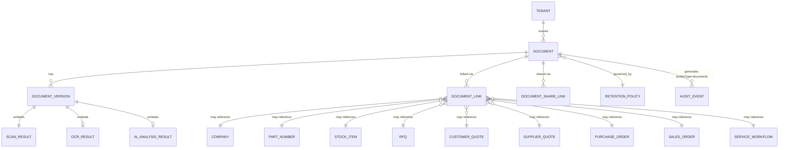
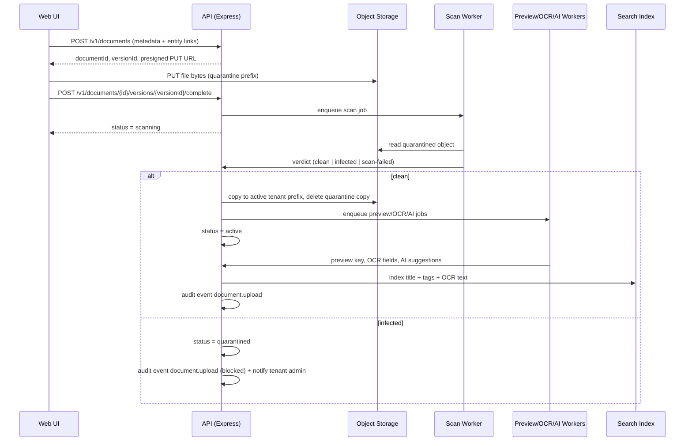
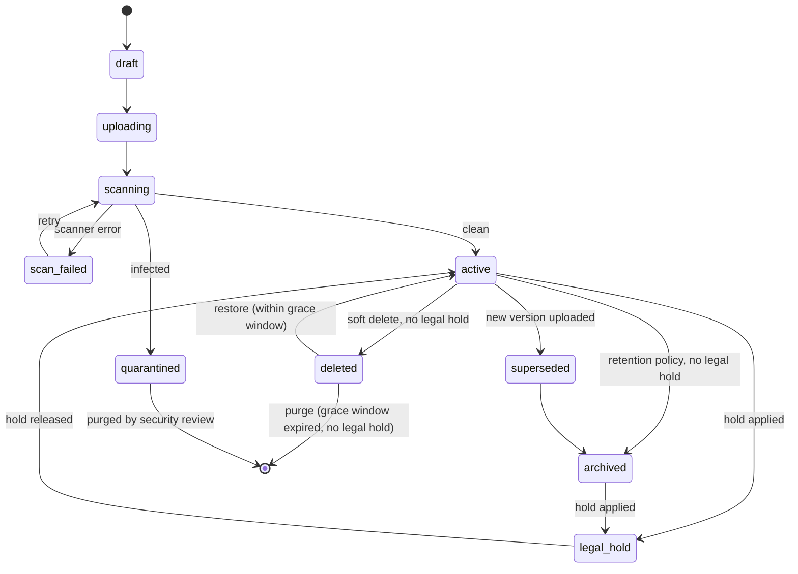

# Documents Architecture

Last updated: 2026-07-02
Status: architecture proposal — not implemented. Implementation guide for future Codex work.

## 1. Purpose & Scope

Documents are not an attachment feature bolted onto other modules. In an aviation ERP, the document *is* often the
product: an 8130-3 is what makes a part sellable, a trace package is what a customer is actually buying alongside
the physical unit, and a missing certificate can block a sale entirely. This module must be designed as a
first-class ERP domain — Document 360 — with the same rigor as Company 360, Part 360, and Stock 360.

This document defines the target architecture for the Documents ecosystem: entity model, storage, security,
lifecycle, workflows, API, UI, migration from Yoyamic, risks, and phased recommendations. It does not implement
code. It is the reference for the next implementation phase.

## 2. Design Principles

1. Every document belongs to exactly one tenant. There is no cross-tenant storage path, index, or query.
2. A document's identity is a generated `documentId`, never a filename. Filenames are metadata, not keys.
3. Files are never served until they have a `clean` malware scan verdict.
4. Every version is retained. Nothing is overwritten in place — this is the single biggest gap in the legacy system.
5. Every access (view, download, share, delete, restore, legal hold) is an audit event, consistent with
   `AuditEvent` in [DATA_MODEL.md](DATA_MODEL.md) and the existing `AuditRepository` contract.
6. AI may suggest (classification, extraction, linking, anomaly flags). AI may not decide. All AI output is
   reviewable and requires human confirmation before it changes a record — consistent with
   [AI_ARCHITECTURE.md](AI_ARCHITECTURE.md) and [AI_ROADMAP.md](AI_ROADMAP.md).
7. Legal hold overrides retention, archival, and deletion, unconditionally, for every document type.
8. Documents attach to the entities that already define this ERP's shape — Company, Part, Stock, RFQ, Quote,
   Purchase Order, Sales Order, Service Workflow — via a link table, not foreign keys embedded on the document
   itself. A single trace package may legitimately belong to a stock line, its sales order, and its shipment.
9. Read-only first. This module ships as a read model over sample/legacy-shaped data before any upload path is
   wired to real storage, matching how Part 360, Stock 360, and Company Inventory shipped.

## 3. Core Entity Model

All entities carry `tenantId` and are resolved only through `RequestContext`, per the existing tenant-isolation
pattern in `packages/shared/src/contracts.ts`.

### Document

The stable, versioned record. Metadata lives here; bytes live in object storage.

| Field | Type | Notes |
|---|---|---|
| `id` | string (UUID) | Canonical identity. Never reused. |
| `tenantId` | TenantId | Required on every row and every query. |
| `category` | DocumentCategory | Coarse grouping — see §5. |
| `documentType` | DocumentType | Fine-grained type — see §5/§6. |
| `title` | string | Human label (legacy `name` field equivalent). |
| `status` | DocumentStatus | `draft \| uploading \| scanning \| quarantined \| scan-failed \| active \| superseded \| archived \| deleted \| legal-hold` |
| `currentVersionId` | string | Points at the active `DocumentVersion`. |
| `uploadedByUserId` | string | Uploader/creator. |
| `ownerCompanyId` | string? | Aviation-context owner (e.g. issuing authority, customer the doc was shared with) — independent of uploader, mirroring the Owner/Company vs. Tag Info separation already codified in [BUSINESS_RULES.md](BUSINESS_RULES.md). |
| `confidentiality` | string | `internal \| customer-shareable \| restricted` |
| `retentionPolicyId` | string | See §18. |
| `legalHold` | boolean | Blocks archive/delete when true, regardless of retention policy. |
| `expiresAt` | string? | For certificates and time-boxed documents (e.g. shelf-life-linked). |
| `tags` | string[] | Free-form + AI-suggested tags. |
| `source` | string | `upload \| generated \| email-ingest \| yoyamic-migration \| ai-derived` |
| `createdAt` / `updatedAt` / `deletedAt` | ISO date | Soft-delete timestamp, not a row removal. |

### DocumentVersion

Immutable once scanned clean. New uploads to an existing document create a new version; they never replace bytes.

| Field | Type | Notes |
|---|---|---|
| `id` | string (UUID) | |
| `documentId` | string | Parent document. |
| `tenantId` | TenantId | Denormalized for query/index efficiency and defense in depth. |
| `versionNumber` | integer | Monotonic per document, starting at 1. |
| `storageKey` | string | Object storage path — see §8. |
| `fileName` | string | Original filename, sanitized, display-only. |
| `mimeType` | string | Detected from content, not trusted from the client `Content-Type` header. |
| `sizeBytes` | integer | |
| `checksumSha256` | string | Computed server-side on receipt; used for dedup and integrity checks. |
| `uploadedByUserId` | string | |
| `uploadedAt` | ISO date | |
| `scan` | ScanResult | Embedded — see §12. |
| `ocr` | OcrResult? | Embedded — see §14. |
| `aiAnalysis` | AiAnalysisResult? | Embedded — see §15. |
| `previewKey` | string? | Rendered thumbnail/first-page preview object key — see §13. |

### DocumentLink

Polymorphic association. A document can be linked to more than one entity (e.g. a trace package linked to a
`StockItem` and to the `SalesOrder` it shipped on). Phase 1.1 makes `DocumentLink` the canonical ownership source:
each document must have exactly one `primary` link in a tenant, and document read models project `ownerModule`,
`ownerRecordId`, and `primaryLink` from that row. The document metadata row must not duplicate ownership fields.

| Field | Type | Notes |
|---|---|---|
| `id` | string | |
| `tenantId` | TenantId | |
| `documentId` | string | |
| `entityType` | string | `company \| part \| stock \| rfq \| supplier-quote \| customer-quote \| purchase-order \| sales-order \| service-workflow \| shipment \| tenant` |
| `entityId` | string | |
| `relation` | string | `primary \| supporting \| reference` — primary is the canonical owner; supporting/reference appear in "also linked to" panels. |
| `linkedByUserId` | string | |
| `linkedAt` | ISO date | |

### ScanResult (embedded on DocumentVersion)

| Field | Type | Notes |
|---|---|---|
| `status` | string | `pending \| clean \| infected \| scan-failed` |
| `engine` | string | e.g. `clamav`, `provider-native` |
| `signature` | string? | Threat signature name if infected. |
| `scannedAt` | ISO date? | |

### OcrResult (embedded on DocumentVersion)

| Field | Type | Notes |
|---|---|---|
| `status` | string | `pending \| completed \| failed \| not-applicable` |
| `extractedFields` | map<string,string>? | e.g. certificate number, PN, SN, expiry date — feeds AI cross-validation. |
| `confidence` | number? | |
| `textIndexed` | boolean | Whether full text was pushed to the search index. |

### AiAnalysisResult (embedded on DocumentVersion)

| Field | Type | Notes |
|---|---|---|
| `status` | string | `pending \| completed \| failed \| not-applicable` |
| `summary` | string? | |
| `suggestedDocumentType` | DocumentType? | Proposed, not applied automatically. |
| `suggestedLinks` | {entityType, entityId, confidence}[]? | Proposed, not applied automatically. |
| `flaggedIssues` | string[]? | e.g. "expiry date has passed", "PN on certificate does not match linked stock line". |
| `modelVersion` | string? | For audit/reproducibility. |
| `analyzedAt` | ISO date? | |

### RetentionPolicy

| Field | Type | Notes |
|---|---|---|
| `id` | string | |
| `tenantId` | TenantId | |
| `name` | string | |
| `appliesToCategory` | DocumentCategory | |
| `retainYears` | integer \| "permanent" | Airworthiness records commonly need life-of-part or permanent retention. |
| `archiveAfterYears` | integer? | Move to cold storage tier before final retention expiry. |
| `legalBasis` | string? | e.g. FAA 14 CFR record-keeping citation, EASA Part-145 reference. |

### DocumentAuditEvent

Not a new table — reuses `AuditEvent` from `packages/shared/src/types.ts` with `entityType: "document"` and
actions such as `document.upload`, `document.view`, `document.download`, `document.version`, `document.delete`,
`document.restore`, `document.legal-hold`, `document.permission-change`, `document.share`, `document.ai-suggestion`.

### DocumentShareLink (Phase 3+)

External, time-boxed, revocable access for sending a certificate or CoC to a customer without granting portal
access.

| Field | Type | Notes |
|---|---|---|
| `id` | string | |
| `documentId` | string | |
| `tenantId` | TenantId | |
| `token` | string | Opaque, unguessable. |
| `expiresAt` | ISO date | |
| `createdByUserId` | string | |
| `revoked` | boolean | |
| `accessLog` | AuditEvent[] | Every access via the link is audited. |

## 4. Entity Diagram



## 5. Taxonomy: Category vs. Document Type

`category` is the coarse grouping used for retention policy, default confidentiality, and top-level UI filters.
`documentType` is the fine-grained label used for search, OCR field mapping, and AI classification.

| Category | Example documentType values |
|---|---|
| `certificate` | `8130-3`, `EASA-Form-1`, `CoC` |
| `trace` | `trace-package`, `birth-certificate`, `repair-tag` |
| `financial` | `invoice`, `credit-note`, `statement` |
| `commercial` | `quotation`, `purchase-order`, `sales-order` |
| `logistics` | `packing-list`, `airway-bill`, `bill-of-lading`, `customs-declaration` |
| `media` | `photo` |
| `correspondence` | `email` |
| `system-generated` | `generated-pdf`, `label` |

This taxonomy is deliberately a controlled enum in `packages/shared/src/types.ts` for Phase 1–2, not a
tenant-editable table. A tenant-configurable taxonomy is a Phase 4+ consideration once real usage data exists.

## 6. Document Type Catalog

Every row below follows the required shape: lifecycle, owner, relations, storage strategy, naming, security,
indexing/search, future AI usage. Unless noted, all types follow the shared lifecycle state machine in §9;
exceptions are called out in the Lifecycle notes column.

| Document type | Owner (module) | Primary relations | Storage strategy | Naming | Security default | Indexing / search | AI usage (future) |
|---|---|---|---|---|---|---|---|
| **8130-3 / EASA Form 1 / CoC** | Quality/Compliance | Stock, Part, Sales Order, Service Workflow | Hot tier indefinitely (never auto-archived while part is active); immutable original preserved forever | `tenant/{tenantId}/certificate/{entityType}/{entityId}/{documentId}/v{n}/{sanitizedName}` | `customer-shareable` (redacted view) / `restricted` (raw with signatures) | OCR required: cert number, PN, SN, issuing authority, expiry, release basis | Cross-validate PN/SN against linked stock line; flag expired/mismatched certs; auto-suggest link to stock line by extracted SN |
| **Trace document / trace package** | Quality/Compliance | Stock, Part, Sales Order | Hot tier; may be a multi-file bundle — model as multiple `DocumentVersion`-linked documents sharing one `DocumentLink` group, not a zip blob | same pattern as certificates | `restricted` by default, opened to `customer-shareable` on sale | OCR + summarization (trace chains can be 10+ pages) | Summarize chain of custody; flag broken/missing links in the chain |
| **Invoice (AR/AP)** | Accounting | Company, Purchase Order, Sales Order | Standard tier, archive after `archiveAfterYears` per jurisdiction (commonly 7 years) | `tenant/{tenantId}/financial/invoice/{companyId}/{documentId}/v{n}/{sanitizedName}` | `restricted` | OCR: invoice number, amount, currency, due date; structured index by company + order | Match invoice line items against PO/SO; flag amount mismatches |
| **Quotation (customer/supplier)** | Sales / Purchasing | RFQ, Customer Quote, Supplier Quote | Standard tier | `tenant/{tenantId}/commercial/quotation/{rfqId}/{documentId}/v{n}/{sanitizedName}` | `customer-shareable` | Structured index by `RFQ_ID` (canonical key per [BUSINESS_RULES.md](BUSINESS_RULES.md)) | Draft assistance already scoped in [AI_ARCHITECTURE.md](AI_ARCHITECTURE.md); this module stores the resulting PDF, not the drafting itself |
| **Purchase order (PDF)** | Purchasing | Company (supplier), Purchase Order record | Standard tier | `tenant/{tenantId}/commercial/purchase-order/{orderId}/{documentId}/v{n}/{sanitizedName}` | `restricted` | Structured index by order number, supplier | Reconcile against received trace/cert documents |
| **Sales order (PDF)** | Sales | Company (customer), Sales Order record | Standard tier | `tenant/{tenantId}/commercial/sales-order/{orderId}/{documentId}/v{n}/{sanitizedName}` | `restricted` | Structured index by order number, customer | Reconcile shipped-document completeness before order close |
| **Shipping document (AWB/BOL/customs)** | Logistics | Sales Order, Purchase Order, Shipment | Standard tier | `tenant/{tenantId}/logistics/shipping/{shipmentId}/{documentId}/v{n}/{sanitizedName}` | `restricted` | OCR: tracking number, carrier, dates | Flag missing export-control paperwork for restricted parts |
| **Packing list** | Warehouse | Sales Order, Shipment, Stock lines shipped | Standard tier | `tenant/{tenantId}/logistics/packing-list/{shipmentId}/{documentId}/v{n}/{sanitizedName}` | `restricted` | Structured index; line-item OCR cross-check against Stock 360 quantities | Flag qty mismatch vs. order (ties into the "Qty 0 is valid" rule — packing lists must reflect true shipped qty, including 0-adjustments) |
| **Photo (stock/part condition)** | Warehouse / Inventory | Stock, Part | Standard tier; generate thumbnail always | `tenant/{tenantId}/media/photo/{stockId}/{documentId}/v{n}/{sanitizedName}` | `customer-shareable` | Filename + tags only (no OCR); future image-embedding search | Condition assessment assist (damage detection) — explicitly future/unscoped, human-reviewed only |
| **Email (ingested correspondence)** | Communications | Company, RFQ, Quote, Order | Standard tier; store original `.eml`/`.msg` plus extracted attachments as separate linked documents | `tenant/{tenantId}/correspondence/email/{threadId}/{documentId}/v{n}/message.eml` | `restricted` | Full-text index of body + subject + participants | Thread summarization; auto-link to RFQ/order by detected reference number |
| **Generated PDF (system-rendered)** | System | Any — quote/PO/SO/label/statement renders | Standard tier; `source: "generated"`, immutable, no user re-upload — regeneration creates a new version | `tenant/{tenantId}/system-generated/{kind}/{entityId}/{documentId}/v{n}/{sanitizedName}` | Inherits confidentiality of the entity it renders | Structured index only | None — these are outputs, not inputs, to AI analysis |

Lifecycle notes / exceptions:

- **Certificates and trace documents** never auto-archive while linked to active stock; retention is
  effectively `permanent` unless the tenant's policy states otherwise, and archival requires the linked stock to
  be sold/scrapped first.
- **Generated PDFs** skip `scanning` (server-generated, not user-uploaded) but still get a checksum and are still
  malware-scanned before storage as defense in depth against template-injection or rendering-library exploits.
- **Emails** enter via ingestion (mailbox connector or forward-to address), not the upload UI; `uploadedByUserId`
  is a system/service account, and the human owner is recorded as `linkedByUserId` on the `DocumentLink`.
- **Photos** get preview/thumbnail generation synchronously where feasible (they're usually already small),
  everything else gets it asynchronously.

## 7. Storage Strategy

- Object storage (S3-compatible: AWS S3, Cloudflare R2, or MinIO for local/dev), not filesystem storage. The
  current legacy system stores files in flat filesystem directories (`docsattachment/`, `docsattachmentcompany/`)
  with no tenant boundary — this must not be repeated.
- One bucket per environment (`saas-aviation-documents-dev`, `-staging`, `-prod`), not one bucket per tenant.
  Tenant isolation is enforced by key prefix plus IAM/query-time authorization, matching how tenant isolation is
  already enforced in the repository layer (`RequestContext` filtering), not by infrastructure sprawl.
- Two-stage landing: uploads land in a `quarantine/` prefix (or a separate quarantine bucket) and are only copied
  to the active `tenant/{tenantId}/...` prefix after a clean scan verdict. Nothing under `tenant/` is ever
  reachable before scanning completes.
- Signed, time-boxed URLs for both upload (presigned PUT) and download (presigned GET) — the API never proxies
  raw bytes through application memory for large files, and never returns a permanent public URL.
- Lifecycle tiering: standard tier while active, transition to infrequent-access/cold tier per
  `RetentionPolicy.archiveAfterYears`, subject to `legalHold` override.

## 8. Naming & Key Convention

Object storage key pattern:

```
tenant/{tenantId}/{category}/{documentType-or-entityType}/{entityId}/{documentId}/v{versionNumber}/{sanitizedFileName}
```

Rules:

- `documentId` (UUID) is the canonical identifier. The key is never derived from the user-supplied filename alone
  — the legacy system used the raw (space-replaced) filename as the storage key, which caused collision checks
  that silently rejected uploads (`file_exists` → "this file already exists", upload blocked, no error surfaced
  to the workflow) and gave no tenant boundary.
- `sanitizedFileName` strips path-traversal sequences, control characters, and restricts to a safe charset;
  original filename is preserved verbatim only as `DocumentVersion.fileName` metadata for display.
- Extension is preserved from sniffed MIME type, not trusted from the client-supplied filename.
- Display title (`Document.title`) is independent of the stored filename, equivalent to legacy `tbl_docs_attachment_*.name` vs. `docs_name` split, but now enforced at the schema level instead of by convention.

## 9. Upload & Processing Workflow

### Sequence



### State machine



Legal hold is modeled as an overlay flag (`Document.legalHold = true`), not a separate branch of the state
machine — a document can be `active` *and* on legal hold simultaneously. The diagram shows it as a state for
readability; in the data model it blocks the `archived`/`deleted`/`purge` transitions from any status.

## 10. Versioning Model

- Every upload to an existing `Document` creates a new `DocumentVersion` with an incremented `versionNumber`.
  `Document.currentVersionId` moves forward; prior versions remain retrievable, never deleted, never overwritten.
- This directly replaces the legacy behavior, which had no versioning at all: re-uploading a file with the same
  name was blocked outright (`file_exists` check), and there was no way to correct a bad certificate scan without
  deleting and re-uploading under a new manual entry, losing history.
- Superseding a certificate (e.g. reissued 8130-3) creates a new version and flips prior version's implicit
  status to non-current, but the old version stays downloadable — this matters for audit defense in an FAA/EASA
  context, where "we had a document at time X" must be provable even after correction.

## 11. Permissions & Tenant Isolation

Extends the existing `Permission` union in `packages/shared/src/types.ts` (currently `tenant.*`, `user.*`,
`company.read`, `part.read`, `stock.read`, `rfq.read`, `audit.read`, `auth.manage`):

| New permission | Grants |
|---|---|
| `document.read` | View metadata, preview, download (subject to `confidentiality`) |
| `document.upload` | Create new documents and versions |
| `document.manage` | Edit metadata, supersede, soft delete, restore, manage links |
| `document.legal-hold.manage` | Apply/release legal hold — should default to `owner_admin`/`tenant_admin` only |
| `document.share` | Create/revoke external `DocumentShareLink`s |

Access resolution order, evaluated per request:

1. `RequestContext.tenant.tenantId` must match `Document.tenantId` — non-negotiable, enforced in the repository
   layer exactly like `CompanyRepository`/`PartRepository`/`StockRepository` today.
2. Role/permission grant must include the relevant `document.*` permission.
3. `confidentiality` gates further: `restricted` documents require an explicit role elevation
   (`document.manage` or higher) beyond baseline `document.read`; `customer-shareable` documents are eligible
   for `DocumentShareLink` issuance; `internal` is the default for anything not explicitly classified.
4. Entity-level read access composes with document access: a user who cannot read a given Stock 360 record
   cannot see its linked documents either, regardless of document-level permission — link resolution must
   re-check the linked entity's own tenant/permission scope, not just the document's.

No page-level checks — consistent with the Technical Debt guardrail against recreating legacy's page-level
session checks. All enforcement is in the API/repository layer; the web app is not the security boundary,
matching the existing static-export caveat in `docs/architecture/auth-tenant-boundaries.md`.

## 12. Malware Scanning

- Mandatory, blocking, before any object leaves the quarantine prefix.
- Recommended: ClamAV as a scan worker (self-hostable, no vendor lock-in) with a pluggable interface so a cloud
  provider's native malware-scanning-for-object-storage can be swapped in later without changing the `ScanResult`
  contract.
- Legacy comparison: the current system's only check is a file-extension blocklist of `.exe` — trivially
  bypassed (renamed executable, macro-laden Office doc, polyglot PDF) and does not inspect content at all. This
  is a real, current gap being carried by the legacy system in production today and must not be replicated.
- Infected files never populate `previewKey`, never get OCR'd, never get indexed, and are not downloadable by any
  role. `quarantined` status surfaces to admins with an audit event and an alert.
- File-size cap enforced (legacy uses 10MB; recommend making this configurable per category — trace packages and
  high-res photo sets legitimately exceed 10MB).

## 13. Preview & Thumbnailing

- PDFs: render first-page preview (PNG/WebP) via a worker (e.g. `pdf.js`/`pdfium` in a sandboxed job).
- Images: resized thumbnail + optionally a medium preview size.
- Office formats (docx/xlsx, if ever accepted): convert to PDF via headless LibreOffice worker, then thumbnail.
- Previews are stored as their own object (`previewKey`) with the same tenant-prefixed key convention, and are
  themselves subject to signed-URL access — never public.
- Phase 2 scope (see §23); not required for the initial read-only Document 360 slice.

## 14. OCR

- Applies primarily to `certificate`, `trace`, `financial`, and `logistics` categories where structured fields
  drive real business value (cross-checking a certificate's PN/SN against the stock line it's attached to is the
  single highest-value AI/automation use case in this module).
- Recommended: a managed document-intelligence service (e.g. AWS Textract, Azure Document Intelligence, Google
  Document AI) for structured field extraction, or Tesseract for a self-hosted baseline text layer feeding
  full-text search only (no structured field mapping).
- `extractedFields` are proposals stored on the version, surfaced in the UI for confirmation, and never silently
  written back onto the linked Stock/Part record.

## 15. AI Document Analysis

Scope, per `AI_ARCHITECTURE.md`'s "tool layer" model and `AI_ROADMAP.md`'s existing "Document and certificate
analysis" line item:

- **Classification** — suggest `category`/`documentType`/`tags` for an ambiguous upload.
- **Extraction** — structured fields from OCR (cert number, PN, SN, expiry, amounts, dates).
- **Cross-validation** — compare extracted fields against the linked entity (does the 8130-3's part number match
  the stock line it's attached to? Has the certificate expired? Does an invoice total match its linked PO?).
- **Linking suggestions** — propose `DocumentLink` candidates for unlinked or ambiguously-linked uploads (e.g. an
  emailed certificate with no explicit stock reference).
- **Summarization** — long trace chains, email threads.
- **Duplicate detection** — checksum-exact and fuzzy (near-duplicate re-scans) detection at upload time.

Hard guardrails (inherited, not new): AI cannot infer ownership, cannot execute a mutation without explicit human
approval, and every suggestion is logged as a `document.ai-suggestion` audit event whether accepted or not.

## 16. Search & Indexing

- Structured/filterable metadata (`category`, `documentType`, `status`, `tenantId`, `entityType`/`entityId`,
  `tags`, date ranges) lives in the primary relational store and is queryable the same way `Company`, `PartNumber`,
  and `StockItem` are today.
- Full-text search (title + OCR-extracted text + tags) needs a dedicated index. Options: Postgres `tsvector` for
  a low-infrastructure Phase 1–2 approach, or a dedicated engine (OpenSearch, Meilisearch, Typesense) once volume
  or relevance requirements outgrow it.
- A tenant-scoped global "Document Center" search must never return cross-tenant results — the index itself must
  be tenant-partitioned or every query must carry a mandatory tenant filter, matching the sample-adapter pattern
  already used for companies/parts/stock.

## 17. Audit Trail

Every state-changing or access event is an `AuditEvent` with `entityType: "document"`:

`document.upload`, `document.version`, `document.view`, `document.download`, `document.share`,
`document.share-revoke`, `document.metadata-edit`, `document.link-add`, `document.link-remove`,
`document.delete`, `document.restore`, `document.legal-hold`, `document.legal-hold-release`,
`document.permission-change`, `document.ai-suggestion`, `document.ai-suggestion-accepted`.

This reuses the existing `AuditRepository.recordAuditEvent` contract rather than introducing a parallel audit
mechanism — Documents is a consumer of the Auth/Tenant Foundation's audit abstraction, not an owner of a new one.

## 18. Retention, Archive, Soft Delete, Legal Hold

- **Retention** is policy-driven per `category` (§3 `RetentionPolicy`), with airworthiness-relevant categories
  (`certificate`, `trace`) defaulting to `permanent` or life-of-part rather than a fixed year count, reflecting
  that FAA/EASA record-keeping expectations are tied to the part's life, not a calendar.
- **Archive** moves the object to a cold storage tier and the `Document.status` to `archived`; metadata and
  audit history remain fully queryable, only the byte-retrieval path gets slower/costlier.
- **Soft delete** sets `deletedAt` and `status: deleted`; the document disappears from default list/search views
  but is restorable within a grace window (recommend 30 days, tenant-configurable later) before a hard purge job
  runs. This is a deliberate improvement over the legacy system, which performs an immediate, unrecoverable
  `unlink()` + `DELETE` on document removal with no grace period.
- **Legal hold** is a boolean overlay that blocks archive, delete, and purge transitions from any state,
  regardless of retention policy expiry. Only `document.legal-hold.manage` permission holders can toggle it, and
  toggling it is itself an audited event.

## 19. API Proposal

Follows the existing `/v1/...` REST convention (`API_ROUTES.md`) and OpenAPI component-schema discipline
(`docs/api/openapi-contracts.md`). All routes require bearer session + tenant context, same as current business
read routes. Mutation routes are specified here as a contract, matching the existing house rule that mutation
routes are defined but not implemented until RBAC/audit/tenant-scope foundations are production-ready.

**Reads (Phase 1 — implementable now, sample-data backed, same pattern as Part 360/Stock 360):**

- `GET /v1/documents` — list/filter by `tenantId` (implicit), `category`, `documentType`, `status`, `entityType`,
  `entityId`, `tags`, `q` (search).
- `GET /v1/documents/{id}` — metadata, version list, links, audit summary.
- `GET /v1/documents/{id}/versions/{versionId}` — single version detail.
- `GET /v1/documents/search?q=` — full-text search across the tenant's document corpus.
- `GET /v1/entities/{entityType}/{entityId}/documents` — documents for a given 360 entity; this is the shape
  `Part360ReadModel.documents`/`Stock360ReadModel.documents`/`CompanyInventoryRow.documents` already anticipate
  as `DocumentAlert[]` and should be generalized to the full `Document` read model.
- `GET /v1/documents/{id}/audit` — audit events for a document.

**Mutations (contract only, future phase, gated behind persistent auth/audit):**

- `POST /v1/documents` — initiate upload: metadata + entity links in, `documentId`/`versionId`/presigned PUT URL out.
- `POST /v1/documents/{id}/versions` — initiate a new version upload on an existing document.
- `POST /v1/documents/{id}/versions/{versionId}/complete` — client confirms upload finished; triggers scan pipeline.
- `GET /v1/documents/{id}/versions/{versionId}/download` — issues a short-lived signed download URL; always audited.
- `GET /v1/documents/{id}/versions/{versionId}/preview` — signed preview URL.
- `PATCH /v1/documents/{id}` — metadata edits (title, tags, category, confidentiality).
- `POST /v1/documents/{id}/links` / `DELETE /v1/documents/{id}/links/{linkId}` — manage entity links.
- `DELETE /v1/documents/{id}` — soft delete. `POST /v1/documents/{id}/restore` — restore within grace window.
- `POST /v1/documents/{id}/legal-hold` / `DELETE /v1/documents/{id}/legal-hold` — toggle legal hold.
- `POST /v1/documents/{id}/share` / `DELETE /v1/documents/{id}/share/{shareId}` — external share links.

**New OpenAPI component schemas to add** in `apps/api/src/openapi/openapi.ts`: `Document`, `DocumentVersion`,
`DocumentLink`, `ScanResult`, `OcrResult`, `AiAnalysisResult`, `RetentionPolicy`, list response wrappers.

## 20. UI Proposal

Builds on components already named (but not yet built out) in `UI_DESIGN_SYSTEM.md`: `DocumentPanel` and
`AuditPanel`.

- **Document Center** (`/documents`) — a new top-level workspace, structurally the same as `/stock/internal`:
  `FilterBar` (category, type, status, entity, date, uploader) over a `DataTable`, using `StatusBadge` for
  `missing / pending-review / expires-soon / clean / quarantined` states — directly extending the existing
  `DocumentAlert.status` vocabulary already defined in `types.ts`.
- **Embedded `DocumentPanel`** on every 360 workspace (Company 360, Part 360, Stock 360 today; RFQ/Quote/PO/SO/
  Service 360 as those modules land) — grouped by category, showing status badges, an upload action (currently a
  boundary panel per `part-360.md`/`stock.md` "Known Gaps," becoming real once storage lands), inline preview,
  and download.
- **Document Detail view** — metadata, `EntityTimeline` of versions, inline preview pane (PDF/image viewer),
  linked entities list, `AuditPanel`, and (permission-gated) legal hold toggle and retention info.
- **Upload flow** — drag-and-drop modal: category/type selection, entity link picker, confidentiality selector,
  client-side extension/size pre-check before requesting the presigned URL (defense in depth, not a substitute
  for server-side scanning).
- **Global search** — topbar search (already part of the `UI_DESIGN_SYSTEM.md` layout) extends to include
  document title/OCR-text matches, landing on Document Center with the query pre-filled.
- Visual language stays consistent with the rest of the ERP: dense, no decorative cards, aviation-red reserved
  for critical status (e.g. `quarantined`, `expires-soon`), never used for the upload/create action.

## 21. Workflow Proposal

See §9 for the upload/scan/process sequence and state machine. Two additional workflows worth naming explicitly:

- **Certificate-to-sale gate**: before a Sales Order tied to a serialized stock line can move to
  `ready-to-ship`, the workflow should surface (not silently block, until this becomes a confirmed business rule)
  whether the linked stock line has an `active`, non-expired, PN/SN-matched certificate — this is the direct
  product answer to `DocumentAlert.status: "missing" | "expires-soon"` already modeled in the dashboard read
  model's `documentsPending`.
- **Email ingestion workflow**: inbound mail to a tenant-scoped ingestion address creates a `Document` with
  `source: "email-ingest"`, the raw message as one version, attachments as separately linked documents, and an
  AI-suggested link to the relevant RFQ/order by detected reference number in the subject/body — surfaced for
  human confirmation, never auto-linked silently.

## 22. Migration Strategy from Yoyamic

Legacy source inventory (confirmed by reading `classes/parts.class.php` and `classes/company.class.php`):

| Legacy element | Shape | Gaps vs. target model |
|---|---|---|
| `tbl_docs_attachment_pn` | `id, name, docs_name, pn, pn_id` | No tenant, no size/mime/checksum, no uploader, no timestamp, no category, no version, no soft delete |
| `tbl_docs_attachment_company` | `id, name, docs_name, id_company` | Same gaps as above |
| `docsattachment/` (flat dir) | filename = original name, spaces→underscores | No tenant boundary, collision-blocks silently reject re-uploads, path-traversal not sanitized |
| `docsattachmentcompany/` (flat dir) | same pattern | Same gaps |
| Upload validation | blocks `.exe` by extension only; 10MB cap | No real malware scanning, trivially bypassed |
| Delete (`del_doc_pn`/`del_doc_company`) | `DELETE` row + `unlink()` | No soft delete, no audit trail, unrecoverable |

Migration stages (mirrors the existing four-stage approach in `MIGRATION_STRATEGY.md`):

1. **Read-only adapter.** A `LegacyDocumentAdapter` implements the `Document` read contract by reading
   `tbl_docs_attachment_pn`/`tbl_docs_attachment_company` and streaming bytes from the existing flat directories
   under the hood — no files are moved yet. This lets Document 360 panels go live against real legacy data
   before any storage migration risk is taken.
2. **Bulk copy + backfill.** For every legacy row: compute `sha256` and detect MIME type from file content (not
   trusted extension), stat file size, generate a new `documentId`, write the object to
   `tenant/{tenantId}/uncategorized-legacy/...` (see next point on category), and create `Document`/`DocumentVersion`
   rows with `source: "yoyamic-migration"`.
3. **Category backfill is explicit, not inferred.** Per the existing business rule "Legacy candidate ownership is
   never inferred or backfilled silently" (`DATA_MODEL.md`), migrated documents land with
   `category: "uncategorized-legacy"` rather than a guessed category. AI-assisted classification (§15) can
   propose categories for a human to confirm in bulk, but nothing is auto-filed as a certificate or trace
   document without review — misfiling a certificate is a compliance risk, not a cosmetic one.
4. **Mandatory scan pass.** Every migrated file is run through the malware scanner (§12) before being served
   through the new system, since none of them were ever scanned under the legacy upload path.
5. **Tenant assignment.** Legacy data currently has no tenant column; every migrated `pn`/`id_company` must be
   resolved to a tenant via the company/part records already migrated by the Auth/Tenant Foundation and Company/
   Part 360 work. If legacy data spans more than one intended tenant, this mapping must be validated before bulk
   copy, not discovered after.
6. **Reconciliation report.** Row count in legacy tables vs. documents created, byte-for-byte checksum spot
   checks, and an explicit "known gap" report for any part/company where the legacy collision-blocking behavior
   likely caused a historical upload to be silently rejected (undetectable with certainty, but flaggable by
   cross-referencing expected-vs-found document counts against any surviving legacy activity logs).
7. **Cutover.** Reads switch from the legacy adapter to native storage per module, matching the existing
   module-by-module cutover principle. Legacy directories remain read-accessible until a validation window closes.

## 23. Risks

1. **Malware scanning gap is a present-day production risk**, not just a migration concern — the legacy system
   accepts any non-`.exe` file today. Treat the scan-worker rollout as security-relevant even before the SaaS
   module fully replaces it.
2. **No tenant boundary in legacy storage.** Flat shared directories mean a migration mapping error is a direct
   cross-tenant data leak, not just a bug. Tenant assignment (§22 step 5) must be validated, not assumed.
3. **Compliance retention vs. generic retention defaults.** Applying a generic "delete after N years" policy to
   certificates/trace documents risks destroying FAA/EASA-relevant records the business is legally required to
   keep. Retention defaults for `certificate`/`trace` categories must be conservative (permanent/life-of-part)
   until legal/compliance confirms otherwise per tenant jurisdiction.
4. **Silent historical data loss is possible and undetectable.** The legacy collision-block behavior
   (`file_exists` → reject) means some historical upload attempts may never have produced a stored file at all.
   Migration cannot recover what was never stored; it can only report the anomaly.
5. **Export control / ITAR-EAR sensitivity.** Some trace/cert documents may contain export-controlled data.
   `confidentiality: "restricted"` plus expiring, revocable `DocumentShareLink`s are necessary, not optional,
   before this module is used for anything customer-facing.
6. **AI misclassification of compliance-critical documents.** An AI-suggested category or link that gets
   silently auto-applied could misfile a certificate. This is why §15 and design principle 6 make AI
   confirmation-only, non-negotiable, for this domain specifically — the cost of a wrong auto-suggestion here is
   materially higher than in, say, a supplier recommendation.
7. **Storage cost growth.** Trace packages and photo sets are typically larger than average ERP attachments;
   lifecycle tiering (§7, §18) needs to exist before volume makes it expensive to retrofit.
8. **Async processing must not block the golden path.** Upload → active must be fast (scan can take seconds);
   OCR/preview/AI must be visibly "pending" in the UI rather than making the whole document unusable while
   background jobs run.

## 24. Recommendations & Phasing

Phased to match the app's existing "read-only first" discipline and its `SAAS_ROADMAP.md` phase structure.

**Phase 1 — Read model foundation (fits the current sprint's read-only stance).**
Add `Document`/`DocumentVersion`/`DocumentLink` types and repository contracts to `packages/shared/src`,
generalizing the existing `DocumentAlert` stub. Sample-data-backed, no real storage. Expose
`GET /v1/documents`, `GET /v1/entities/{type}/{id}/documents`. Build `DocumentPanel` for real on Company 360,
Part 360, Stock 360 (currently boundary-panel placeholders per their "Known Gaps" sections). This phase requires
no infrastructure decisions and follows the exact precedent Part 360/Stock 360/Company Inventory already set.

**Phase 2 — Upload, storage, security foundation.**
Object storage integration, presigned upload flow, malware scanning, checksum, real versioning, the new
`document.*` permissions, persisted audit events, soft delete with grace window. Gated on the same prerequisite
already called out project-wide: persistent auth/session/audit storage replacing the current in-memory
implementation.

**Phase 3 — Preview, OCR, search.**
Thumbnail/preview workers, OCR extraction for certificate/trace/financial categories, full-text search index,
Document Center workspace.

**Phase 4 — AI and retention automation.**
AI classification/extraction/cross-validation suggestions (human-confirmed only), `RetentionPolicy` engine,
legal hold workflow, archive tiering, `DocumentShareLink`s.

**Phase 5 — Yoyamic cutover.**
Bulk migration per §22, reconciliation reporting, module-level cutover, legacy directory decommission only after
the validation window closes — consistent with `MIGRATION_STRATEGY.md`'s "Yoyamic remains the source of truth
until cutover" rule.

## 25. Open Decisions

These need an explicit answer before Phase 2 implementation starts (flagging rather than deciding unilaterally,
consistent with this project's pattern of leaving infra choices as documented TBDs until approved):

1. Object storage provider (S3 vs. R2 vs. self-hosted MinIO) and whether it differs dev/staging/prod.
2. Malware scan engine: self-hosted ClamAV worker vs. a managed/cloud-native scanning service.
3. OCR/document-intelligence provider, and whether it's the same vendor as the future AI/LLM provider for
   consistency of data handling agreements.
4. Search index technology: Postgres `tsvector` (simpler, fits current stack) vs. a dedicated engine (better
   relevance/scale, more infra).
5. Default retention years per jurisdiction for non-airworthiness categories (financial/logistics) — likely a
   legal/accounting input, not an engineering one.
6. Whether `DocumentCategory`/`DocumentType` should become tenant-configurable before or after the first
   non-AeroCanada tenant onboards.
