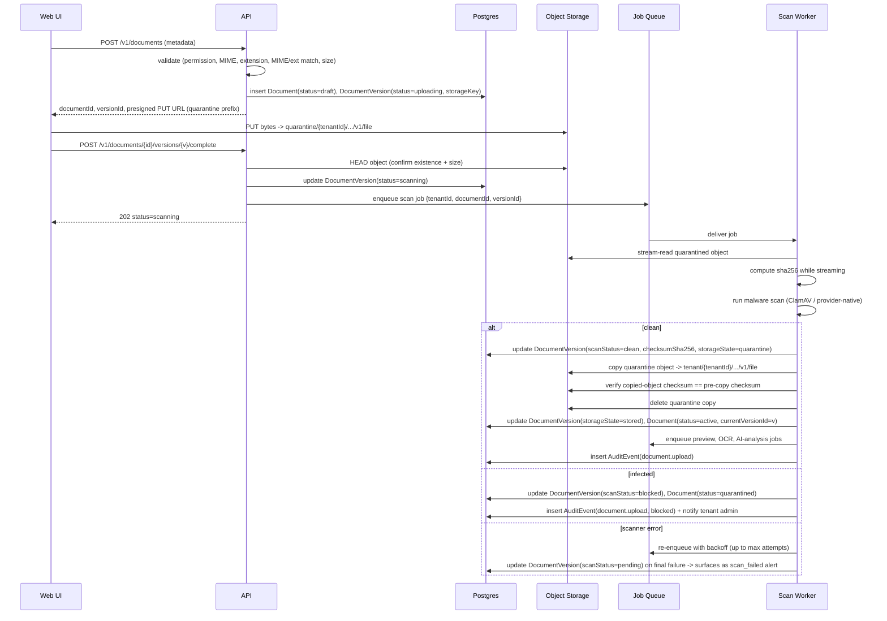
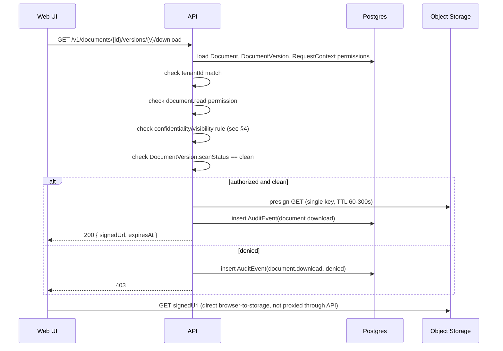
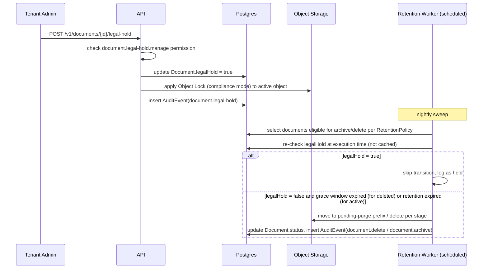
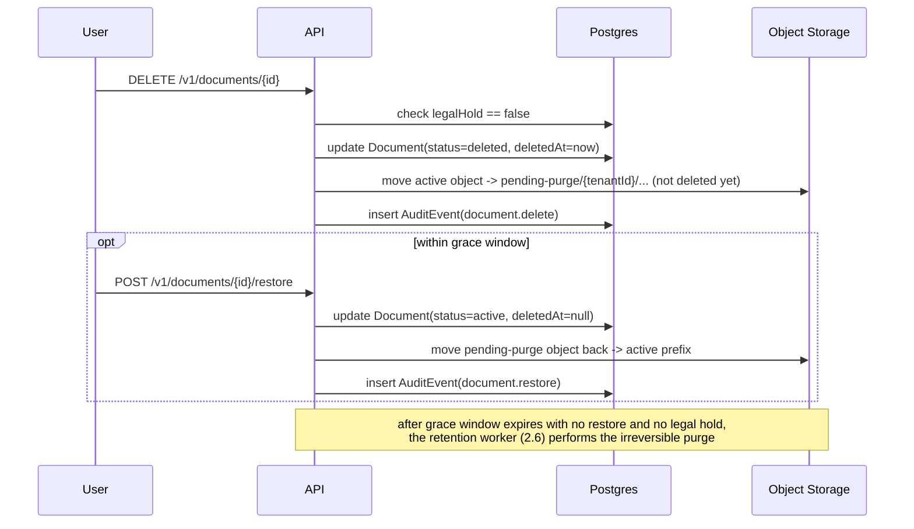
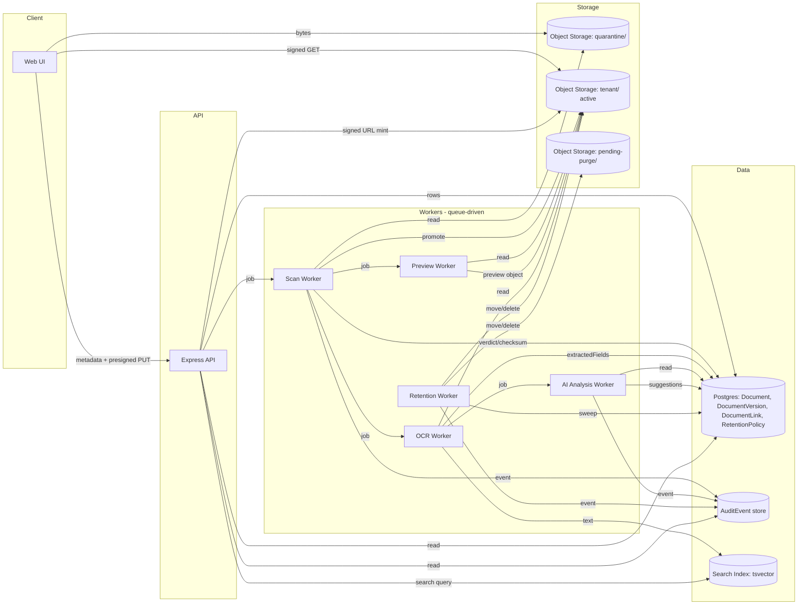

# Documents Phase 2 Architecture

Last updated: 2026-07-02
Status: architecture proposal — not implemented. Documentation only, no code or infrastructure changes.
Author context: prepared as the design input for the Documents Phase 2 sprint, following the Phase 1 foundation
review of commit `46f6e72` ("Build documents foundation") and while the Phase 1.1 corrective sprint is in
progress separately.

## 0. Relationship to Existing Documents

This is not a replacement for `DOCUMENTS_ARCHITECTURE.md` — that document is the full target architecture
(entity model, taxonomy, document type catalog, UI proposal, Yoyamic migration strategy) and remains authoritative
for those areas. This document is scoped narrowly to what the prompt asked for: the **execution architecture for
Phase 2** — object storage, pipelines, workers, lifecycle, security, API/DB evolution, deployment, and risk —
written concretely enough to hand to implementation, with sequence and data-flow diagrams the target doc
summarizes more briefly.

Where this document and `DOCUMENTS_ARCHITECTURE.md` overlap, this one is the more detailed, Phase-2-specific
version; section references back to that document (`§N`) are given instead of repeating unrelated content
(taxonomy, UI components, business workflow proposals).

### 0.1 Hard prerequisites from the Phase 1 review

The Phase 1 review (commit `46f6e72`) found four issues that this architecture treats as **non-negotiable
inputs**, not just recommendations, because Phase 2 makes each of them materially worse if left unresolved:

| # | Phase 1 finding | Why Phase 2 cannot be built on top of it as-is |
|---|---|---|
| 1 | `document.read` permission and `visibility: "restricted"` are never enforced on any read route | Phase 2 adds byte-serving (signed URLs, previews). An unenforced visibility model today becomes an unenforced *download* model tomorrow — the exact same gap, just now leaking file contents instead of metadata. §11.3 and §4 below make closing this a blocking precondition, not a parallel task. |
| 2 | `DocumentRecord.ownerModule/ownerRecordId` and `DocumentLinkRecord` are two unreconciled sources of truth for "who owns this document" | Phase 2 introduces write paths (upload, versioning, link management) that can put these out of sync for the first time. §6 below picks one authority before schema is finalized. |
| 3 | `uploadedAt` in the upload-intent response is a hardcoded literal, not real time | Cosmetic in Phase 1 (nothing persists). Phase 2 persists this value; a fabricated timestamp in a persisted, audited record is a compliance defect, not a display nit. Called out again in §6.1 as a schema/service note. |
| 4 | `DocumentAlert` (legacy compliance/expiry model) and `DocumentRecord` (new file model) coexist unreconciled | Phase 2's retention/expiry engine (§1.11) and the "certificate-to-sale gate" workflow both need a single source of truth for "is this stock line's certificate current." §1.11 proposes the reconciliation. |

Everything else in the Phase 1 review (pagination, MIME/extension cross-check, status enum gaps, dead `.exe`
check, permission-denied status code) is addressed as part of the normal Phase 2 design below and does not block
starting the work.

---

## 1. Phase 2 Architecture

### 1.1 System shape addition

Phase 1 is two containers (`web`, `api`) with no database and no object storage (`docker-compose.yml` today has
exactly those two services). Phase 2 adds:

```text
apps/web        (existing) Next.js UI — gains upload UI, preview viewer, legal-hold controls
apps/api        (existing) Express API — gains mutation routes, signed-URL minting, job enqueue
apps/workers    (new)      background job runners: scan, checksum-verify, preview, OCR, AI-analysis, retention
packages/shared (existing) gains persistence-facing repository implementations alongside sample-data ones
infra: postgres (new)      relational store for Document/DocumentVersion/DocumentLink/RetentionPolicy/AuditEvent
infra: object storage (new) S3-compatible bucket(s) — quarantine + active prefixes
infra: queue (new)         job queue between API and workers (see §1.2)
infra: search index (new)  Postgres tsvector to start (§1.12), swappable later
```

This mirrors the existing "adapter-first" principle in `ARCHITECTURE.md` §Data Access: `SampleDataSource`
continues to exist for tests/demos, and a new `PostgresDocumentRepository` + `ObjectStorageDocumentBlobStore`
implement the same `DocumentRepository` contract from `packages/shared/src/contracts.ts`, so `apps/api/src/server.ts`
route handlers do not change shape — only which implementation `getLegacyDataSource()`-equivalent wiring selects.

### 1.2 Job queue

A queue sits between the API and the worker pool for every asynchronous stage (scan, checksum-verify, preview,
OCR, AI analysis, retention sweep). Recommendation: start with a Postgres-backed queue (e.g. a `job_queue` table
with `SELECT ... FOR UPDATE SKIP LOCKED`, or a managed extension) rather than standing up Redis/SQS/RabbitMQ as a
new piece of infrastructure — this matches the project's stated bias ("Keep Kubernetes/ECS optional until
workload... requirements justify it," `docs/INFRA_DECISIONS.md`) of not adding infrastructure ahead of proven
need. A message-broker swap (SQS, Redis Streams) is a drop-in replacement behind a `JobQueue` interface later if
throughput demands it — this is listed as an open decision in §9.2, not decided here.

Every job carries `{ tenantId, documentId, versionId, jobType, attempt, enqueuedAt }`. Workers are stateless and
horizontally scalable; retries use exponential backoff with a max-attempt dead-letter state that surfaces as
`scan_failed` / an equivalent `*_failed` status rather than retrying forever.

### 1.3 Object storage architecture

- **Provider-agnostic interface.** `ObjectStorageBlobStore` (put, presign-put, presign-get, copy, delete, head) —
  implemented against any S3-compatible API (AWS S3, Cloudflare R2, MinIO for local/dev/CI). No provider-specific
  code in `apps/api` or `apps/workers` business logic; provider choice is an environment-level config swap.
- **One bucket per environment**, not per tenant (`saas-aviation-documents-dev/staging/prod`), consistent with
  `DOCUMENTS_ARCHITECTURE.md §7`. Tenant isolation is enforced by key-prefix convention (§1.9) plus
  application-layer authorization at every mint/read, not by bucket sprawl.
- **Two logical prefixes per bucket**: `quarantine/{tenantId}/...` and `tenant/{tenantId}/...` (active). A
  document's bytes exist in exactly one of these at a time; the copy from quarantine to active is the only
  operation that promotes a file to servable, and it only happens after a `clean` scan verdict (§1.5).
- **Versioning at the bucket level enabled** (S3 bucket versioning or equivalent) as a second safety net beneath
  the application's own `DocumentVersion` model — protects against accidental overwrite-by-key-collision bugs,
  not a substitute for the app-level version records.
- **Object Lock (WORM) on the active prefix for `legal-hold` and `certificate`/`trace` categories** — see §1.10.
  This is an infrastructure-level enforcement of legal hold, not just an application flag, matching the principle
  that a compromised or buggy retention worker must not be the only thing standing between a hold and permanent
  deletion.
- **Lifecycle tiering rules** configured at the bucket/prefix level: standard tier while `active`, transition to
  infrequent-access after `RetentionPolicy.archiveAfterYears`, subject to legal-hold override (bucket lifecycle
  rules alone cannot check `legalHold` — the retention worker, not a bucket lifecycle rule, drives archive/purge
  transitions; bucket lifecycle rules are used only for storage-class cost optimization within the `active`
  state, never for deletion).

### 1.4 Upload pipeline

Two-phase, presigned-URL pattern — the API never proxies file bytes through its own process memory:

1. Client calls `POST /v1/documents` (new document) or `POST /v1/documents/{id}/versions` (new version) with
   metadata only (same shape as today's `DocumentUploadRequest`, run through the existing
   `validateDocumentUploadRequest` checks plus the extension/MIME cross-check from the Phase 1 review, §5 below).
2. API creates a `Document`/`DocumentVersion` row in status `draft`/`uploading`, generates a `documentId`/
   `versionId`, computes the deterministic storage key (§1.9), and returns a **presigned PUT URL scoped to that
   exact key**, expiring in minutes.
3. Client uploads bytes directly to the `quarantine/` prefix via the presigned URL.
4. Client calls `POST /v1/documents/{id}/versions/{versionId}/complete`. The API does **not** trust the client's
   claim that the upload succeeded — it performs a `HEAD` on the object to confirm existence and size match
   before transitioning status to `scanning` and enqueuing the scan job. A `complete` call for an object that
   doesn't exist or doesn't match the declared size is rejected and logged (defends against a client claiming
   completion without actually uploading, or uploading a different file than declared).
5. From here the scan → checksum → (clean: promote + fan out preview/OCR/AI; infected: quarantine) pipeline in
   §2.1 takes over.

### 1.5 Quarantine workflow

- Nothing under `tenant/{tenantId}/...` is ever reachable before a `clean` verdict — enforced by IAM/bucket
  policy (the application's write credentials for the `tenant/` prefix are only used by the promotion step, not
  by the upload-URL-minting path), not just by application logic, so a bug in the API cannot accidentally hand
  out a presigned PUT/GET into the active prefix before scanning.
- On `clean`: worker (or API, transactionally) copies quarantine object → active prefix, verifies the copied
  object's checksum matches the pre-copy checksum (§1.6), then deletes the quarantine copy. The `DocumentVersion`
  row's `storageState` flips from `quarantine` to `stored` only after the copy+verify succeeds — if the copy
  fails partway, the row stays `quarantine` and the promotion job retries; a document is never marked `active`
  while it might not actually exist at its expected active-prefix key.
- On `infected`: object stays in `quarantine/`, `DocumentVersion.scanStatus = "blocked"`, `Document.status =
  "quarantined"`. Quarantined objects are retained for a bounded period (recommend 90 days) for forensic review,
  then purged by the same retention worker that handles soft-delete purges (§1.9 of the state machine), never
  auto-restored to active under any circumstance.
- On `scan-failed` (scanner error, not a threat verdict): retried with backoff; after max attempts, surfaces to
  tenant admins as an actionable alert rather than silently stuck — this is distinct from `infected` and must
  never be treated as equivalent to clean by any fallback logic ("scanner unavailable" must never default-permit).

### 1.6 SHA-256 checksum strategy

- Computed **server-side**, streaming, during the scan-worker's read of the quarantined object — never trusted
  from a client-supplied header, matching `docs/security/documents.md`'s existing requirement.
- Three uses:
  1. **Integrity verification** across the quarantine→active copy (checksum before copy must equal checksum
     after copy; mismatch aborts promotion and alerts, rather than marking the file active).
  2. **Tamper-evidence.** Stored immutably on `DocumentVersion.checksumSha256`; any future re-derivation that
     doesn't match indicates corruption or out-of-band modification of the stored object, which should never
     happen given WORM/Object Lock (§1.3) but is a useful periodic integrity-audit signal (§1.13 DR).
  3. **Intra-tenant duplicate detection**, surfaced to the uploader ("this file matches an existing document") as
     a suggestion, never an automatic block or merge. **Checksum comparison is scoped to a single tenant only** —
     cross-tenant checksum matching (even to just say "this file exists elsewhere") is an inference side-channel
     that could leak the existence of another tenant's data and must not be implemented, full stop.
- Checksums are not a substitute for malware scanning (a known-clean checksum only proves "this exact byte
  sequence was scanned before," which is a valid *optimization* — skip re-scanning an exact duplicate within the
  same tenant if its checksum matches a document already `clean` — but every first-seen upload is always scanned
  regardless of checksum).

### 1.7 Version lifecycle

- Extends `DOCUMENTS_ARCHITECTURE.md §10`. Monotonic `versionNumber` per document, assigned transactionally
  (`SELECT ... FOR UPDATE` on the parent `Document` row, or a dedicated per-document counter row) to avoid a race
  where two concurrent version uploads both compute the same "next" number.
- A version is immutable once `scanStatus = "clean"`: no field on a clean `DocumentVersion` is ever updated in
  place except the embedded `ocr`/`aiAnalysis`/`previewKey` results, which are additive fill-ins for a version
  that otherwise doesn't change (the original bytes, checksum, and scan verdict never change after the fact).
- `Document.currentVersionId` only advances after the new version reaches `active`; a version stuck in
  `scanning`/`quarantined` never becomes current, so the document's primary pointer never references
  an unservable version.
- Superseding does not delete the prior version's row or object — it remains independently downloadable and
  auditable, which is the direct compliance requirement called out in `DOCUMENTS_ARCHITECTURE.md §10` ("we had a
  document at time X must be provable even after correction").

### 1.8 Signed download URLs

- The API is the only party that mints a signed URL, and only after: (a) tenant match, (b) `document.read`
  permission, (c) `confidentiality`/visibility check passes for the requesting user (§4), (d) the target
  version's `scanStatus == "clean"`. A signed URL is never generated for an infected, pending, or not-yet-active
  version.
- Scoped to exactly one object key (never a prefix or wildcard), short-lived (recommend 60–300 seconds — long
  enough for a browser to start the download, short enough that a leaked link is not a standing risk), and
  single-purpose (a download URL and a preview URL are minted separately, even for the same object, so preview
  access and full-download access can carry different authorization rules later, e.g. a `customer-shareable`
  preview without full-resolution download).
- Every mint is an audit event (`document.download` / `document.preview`) recorded **at mint time**, not
  assumed from the fact that a URL was generated — matches `docs/security/documents.md`'s existing requirement
  that "every upload, view, download, version, delete, restore, share, and legal-hold action must be audited,"
  but this is the first point where that requirement has an actual implementation shape (Phase 1 has no
  byte-serving to audit).
- `DocumentShareLink` (external, revocable, time-boxed access — `DOCUMENTS_ARCHITECTURE.md §3`) is explicitly
  deferred to Phase 3+ per that document; Phase 2 signed URLs are for authenticated in-app users only.

### 1.9 Storage key convention (unchanged from target architecture)

Reuses `DOCUMENTS_ARCHITECTURE.md §8` verbatim:
`tenant/{tenantId}/{category}/{documentType-or-entityType}/{entityId}/{documentId}/v{versionNumber}/{sanitizedFileName}`,
with `quarantine/{tenantId}/...` as the pre-promotion mirror of the same suffix. Restated here because §1.5/§1.6
depend on the key being deterministic and computed server-side at intent-creation time, before any bytes exist.

### 1.10 Preview architecture

- Triggered only after `scanStatus == "clean"` — never rendered from a quarantined or unscanned object, since
  preview generation itself means opening/parsing untrusted file content.
- Renderer runs in an isolated worker with **no network egress**, as defense in depth against a malicious file
  exploiting the rendering library itself (a PDF/image parser vulnerability is a realistic attack surface
  independent of the malware scanner's signature-based detection).
- PDFs: first-page render to PNG/WebP (`pdf.js`/`pdfium`). Images: resized thumbnail. Office formats (docx/xlsx):
  convert-to-PDF via a sandboxed headless-LibreOffice step, then the same PDF-preview path — this conversion
  step is itself sandboxed and network-isolated for the same reason.
- Preview output is stored as its own object (`previewKey`) under the same tenant-prefixed convention and is
  itself only ever accessed via signed URL — never a public asset, even for a "customer-shareable" document,
  since "shareable" still means "shared with an authenticated, authorized party," not "public."
- A failed or pending preview never blocks the document from being `active`/downloadable — the UI shows a
  placeholder, not an error state, and preview generation retries independently of the main upload pipeline.

### 1.11 OCR pipeline

- Queued immediately after promotion to `active`, for `certificate`, `trace`, `financial`, and `logistics`
  categories where structured extraction has direct business value (per `DOCUMENTS_ARCHITECTURE.md §14`); other
  categories may get full-text-only OCR (feeds search, §1.12) or skip OCR entirely (e.g. `photo`).
- `extractedFields` (cert number, PN, SN, issuing authority, expiry date, amounts) are written to
  `DocumentVersion.ocr` as **proposals**, surfaced in the UI for human confirmation, and never silently written
  back onto the linked Stock/Part/Company record — the OCR worker has read access to the document object and
  write access only to `DocumentVersion.ocr`, not to any other domain table.
- **Reconciling `DocumentAlert` (prerequisite item #4, §0.1):** the existing `DocumentAlert`-driven "certificates"
  view on Part 360/Stock 360 and the dashboard's "Documents pending" widget should become computed views over
  `DocumentRecord` + `DocumentVersion.ocr.extractedFields.expiryDate` (or `Document.expiresAt` once populated by
  OCR/manual entry) rather than a separately maintained alert table. This is a Phase 2 data-migration task, not
  a bigger rewrite: `DocumentAlert.status: "missing" | "expires-soon"` becomes a derived query (`no active
  certificate-category document linked to this stock line` / `expiresAt within N days`) instead of a
  hand-maintained record. Recommend landing this as its own sub-task early in Phase 2 rather than carrying two
  models through the whole phase.

### 1.12 AI certificate analysis

- Strictly downstream of OCR — consumes `extractedFields`, never raw bytes directly, keeping the AI tool layer
  decoupled from file parsing per `AI_ARCHITECTURE.md`'s "tool layer" model.
- Scope (per `DOCUMENTS_ARCHITECTURE.md §15`): classification suggestions, cross-validation against the linked
  Stock/Part record (PN/SN match, expiry check), link suggestions for ambiguously-linked uploads, trace-chain
  summarization, duplicate-content flagging (using the intra-tenant checksum signal from §1.6 as one input, not
  the only one).
- **Hard guardrail, non-negotiable for this domain specifically:** every suggestion is stored, surfaced, and
  requires explicit human confirmation before it changes any record (`Document.category`, `DocumentLink`, or any
  linked Stock/Part field) — no auto-apply path exists even as a "trusted tenant" opt-in, because a
  misclassified or wrongly-linked certificate is a compliance defect, not a UX inconvenience. Every suggestion
  and every accept/reject decision is a `document.ai-suggestion` / `document.ai-suggestion-accepted` audit event.
- Per `AI_ARCHITECTURE.md`'s current status ("No LLM provider... implemented"), this pipeline is designed behind
  a provider-agnostic interface (`AiAnalysisProvider`) with a no-op/mock implementation until the project-wide
  LLM provider decision lands — Documents Phase 2 does not force that decision; it just doesn't block on it
  (OCR/scan/preview/checksum all ship and function with `aiAnalysis.status = "not-applicable"` until a provider
  exists).

### 1.13 Legal hold

- Modeled as an overlay boolean (`Document.legalHold`), not a branch of the state machine — a document can be
  `active` and on legal hold simultaneously (per `DOCUMENTS_ARCHITECTURE.md §9` state-machine note).
- **Two independent enforcement layers**, not one:
  1. **Application layer** — the retention/purge worker (§1.14) checks `legalHold` immediately before issuing any
     delete/archive transition, as a read that happens inside the same transaction as the delete decision (not a
     cached or earlier-fetched flag).
  2. **Infrastructure layer** — S3 Object Lock (governance or compliance mode) applied to objects under legal
     hold, so that even a bug or a compromised worker credential cannot physically delete the underlying object.
     This is the "second lock on the door" principle: application logic bugs happen, and a compliance-critical
     guarantee should not rest on application logic alone.
- Only `document.legal-hold.manage` permission holders (default: `owner_admin`/`tenant_admin`) can toggle it;
  toggling is itself an audited event (`document.legal-hold`, `document.legal-hold-release`).

### 1.14 Retention policies

- `RetentionPolicy` (per `DOCUMENTS_ARCHITECTURE.md §3`) is evaluated by a scheduled retention worker (nightly
  batch), not computed on read — retention decisions are stateful transitions (`active → archived`,
  `active → deleted`), not query-time filters.
- Airworthiness-relevant categories (`certificate`, `trace`) default to `permanent`/life-of-part retention,
  requiring the retention worker to check "is the linked stock line still active" via the existing
  `StockRepository` before considering a certificate archive-eligible — this is a cross-module read, not a raw
  join, consistent with the adapter-contract discipline in `ARCHITECTURE.md`.
- Legal hold (§1.13) blocks every transition this worker would otherwise make, checked at execution time.
- Default retention years for non-airworthiness categories (financial/logistics) are an explicit open decision
  (§9.2 item 5) requiring legal/accounting input — this architecture does not hardcode a guess.

### 1.15 Soft delete

- `DELETE /v1/documents/{id}` sets `deletedAt` + `status: deleted`; disappears from default list/search views,
  restorable via `POST /v1/documents/{id}/restore` within a grace window (recommend 30 days).
- **Storage-side mirrors the upload-quarantine pattern symmetrically:** rather than deleting the object
  immediately, a soft-deleted document's object is moved to a `pending-purge/{tenantId}/...` prefix (or flagged
  for a delayed lifecycle-rule deletion) so that a grace-window restore doesn't depend on the object never having
  been touched — restore within the window moves it back; only the hard-purge job (after grace window expiry
  **and** no legal hold) performs the irreversible delete.
- This is a deliberate improvement over the legacy system's immediate, unrecoverable `unlink()` + `DELETE`
  (`DOCUMENTS_ARCHITECTURE.md §22`).

### 1.16 Audit model

- Reuses the existing `AuditEvent`/`AuditRepository` contract (`entityType: "document"`) rather than introducing
  a parallel mechanism — Documents is a consumer of the Auth/Tenant Foundation's audit abstraction.
- **New requirement Phase 2 introduces that Phase 1 didn't need:** *read/access* events (`document.view`,
  `document.download`, `document.preview`) must be audited, not just mutations. This is stronger than most other
  modules' audit needs (company/part/stock reads aren't individually audited today) because "who viewed this
  restricted contract" is itself a compliance question for aviation records — the audit model for Documents is
  intentionally not just "reuse the same bar as everything else."
- Audit persistence itself is a project-wide open item (`PROJECT_STATE.json` lists "Replace in-memory auth/session
  storage with persistent provider-backed implementation" as still pending) — Documents Phase 2 cannot ship
  audited downloads against an in-memory audit store that resets on process restart; persisted audit storage is
  therefore a shared dependency, not a documents-specific task, and is called out again in §9.1 as a sequencing
  dependency rather than something this phase re-solves independently.

### 1.17 Search and indexing

- Structured/filterable metadata (`category`, `documentType`, `status`, `entityType`/`entityId`, `tags`, date
  ranges) lives in the relational store, queried the same way Company/Part/Stock are today.
- Full-text (title + OCR text + tags): start with Postgres `tsvector` — no new infrastructure, adequate at
  expected Phase 2 volume. A dedicated engine (OpenSearch/Meilisearch/Typesense) is a swap-in later behind a
  `DocumentSearchIndex` interface if relevance or volume outgrows `tsvector`, not a Phase 2 requirement.
- The index (whichever implementation) must be tenant-partitioned or every query must carry a mandatory tenant
  filter enforced at the query-builder level, not left to each call site to remember — recommend a single
  `searchDocuments(context, query)` entry point that makes an unscoped search structurally impossible to write,
  mirroring how `tenantItems()` makes unscoped reads structurally impossible in the current shared package.

### 1.18 Performance for millions of documents

- **Pagination:** keyset/cursor pagination on a composite `(tenantId, createdAt, id)` index for all list
  endpoints — never offset-based pagination, which degrades linearly with offset depth and is the first thing
  that breaks at this scale.
- **Indexes:** `(tenant_id, entity_type, entity_id)` for entity-document lookups, `(tenant_id, status)` for
  dashboard/summary queries, `(tenant_id, document_type)` and `(tenant_id, created_at)` for list/filter views —
  see §6.2 for the concrete DDL.
- **No more in-memory O(documents × versions × links) scans.** The current `composeDocuments()` in
  `packages/shared/src/document-service.ts` filters three full arrays per request — correct at sample-data scale,
  not viable once these are real tables. Phase 2's repository implementation replaces this with indexed joins
  (fetch a page of documents, then batch-fetch their current versions and links by `documentId IN (...)`, not a
  filter over the entire table per document).
- **Summary counters are pre-aggregated, not computed per request.** `DocumentCenterReadModel.summary` (total,
  clean, needsReview, restricted, totalSizeBytes) must not be a `COUNT(*)`/full-table scan on every page load at
  millions-of-rows scale — maintain a per-tenant rollup row updated transactionally (or near-real-time via a
  trigger/outbox) alongside document writes, and read the rollup for the summary panel.
- **Object storage key distribution:** `tenant/{tenantId}/...` prefixes are fine at Phase 2 scale on any modern
  S3-compatible provider (automatic prefix partitioning handles this today, unlike a decade ago); flagged only as
  a later consideration if a single tenant's request rate against one prefix becomes extreme, not a Phase 2
  concern.

### 1.19 Multi-tenant isolation

Four independent layers, all required (defense in depth — no single layer is trusted alone):

1. **Storage key prefix** (`tenant/{tenantId}/...`) — necessary but not sufficient by itself, since a
   misconfigured IAM policy could still allow cross-prefix reads.
2. **Database row-level filtering**, enforced in the repository layer exactly like `CompanyRepository`/
   `PartRepository`/`StockRepository` today — `RequestContext.tenant.tenantId` must match `Document.tenantId` on
   every query, non-negotiable. Recommend evaluating Postgres Row-Level Security policies as a second, DB-native
   enforcement layer beneath the application-layer filter (same "second lock on the door" principle as legal
   hold, §1.13) — an application bug that forgets a `WHERE tenant_id = ...` clause should not, by itself, be a
   cross-tenant data leak if RLS is also in place.
3. **Search index partitioning** (§1.17) — the index must not be a side channel that bypasses the DB-layer
   tenant filter.
4. **Signed URL scoping** (§1.8) — a URL is minted for one object key after an explicit tenant + permission +
   confidentiality check; it is never derived from a prefix or reusable across documents.

This resolves prerequisite item #1 (§0.1): closing the permission/visibility enforcement gap from Phase 1 is
what makes layer 2 actually mean something for `document.read` and `restricted` visibility, not just for
`tenantId`.

### 1.20 Disaster recovery

- **Object storage:** cross-region replication for the active bucket/prefix (at minimum for `certificate`/
  `trace`/`legal-hold` categories, which carry the highest compliance cost if lost); bucket versioning (§1.3)
  protects against accidental overwrite; Object Lock (§1.13) protects legal-hold content from deletion even by a
  compromised credential.
- **Database:** point-in-time recovery (PITR) enabled before any production write path goes live — this is
  already stated as a blanket project requirement in `docs/INFRA_DECISIONS.md` ("Backup/PITR: required before
  any production write path"); Documents is the first module whose write path makes this concrete and urgent,
  since document metadata loss without a matching object-storage loss (or vice versa) creates orphaned records or
  orphaned bytes.
- **Search index:** not backed up independently — it is fully rebuildable from the relational store + OCR text,
  so DR strategy is "reindex," not "restore a search snapshot." This should be validated with a rebuild-time
  estimate once real volume exists, so "just reindex" remains a credible plan at scale, not just at day one.
- **Consistency drills:** periodic reconciliation job comparing DB `DocumentVersion` rows against actual object
  storage keys (existence + checksum) in both directions — orphaned DB rows (object missing) and orphaned objects
  (no matching row) are both signals of a DR event or a pipeline bug, and should alert rather than fail silently.
- **RTO/RPO targets** are an explicit open decision (§9.2) pending infrastructure/provider selection — not
  guessed at here.

---

## 2. Sequence Diagrams

### 2.1 Upload → quarantine → scan → checksum → promote



### 2.2 New version / supersede

```mermaid
sequenceDiagram
    participant UI as Web UI
    participant API as API
    participant DB as Postgres

    UI->>API: POST /v1/documents/{id}/versions (metadata)
    API->>DB: BEGIN; SELECT Document FOR UPDATE
    API->>DB: compute next versionNumber = max(existing)+1
    API->>DB: insert DocumentVersion(status=uploading, versionNumber)
    API->>DB: COMMIT
    API-->>UI: versionId, presigned PUT URL
    Note over UI,API: same quarantine -> scan -> promote flow as 2.1 for this version
    Note over API,DB: Document.currentVersionId only advances once this version reaches active;<br/>prior version remains independently stored and downloadable
```

### 2.3 Signed download URL issuance



### 2.4 Preview generation

```mermaid
sequenceDiagram
    participant SCAN as Scan Worker
    participant Q as Job Queue
    participant PREV as Preview Worker (sandboxed, no egress)
    participant OBJ as Object Storage
    participant DB as Postgres

    SCAN->>Q: enqueue preview job (only after scanStatus=clean)
    Q->>PREV: deliver job
    PREV->>OBJ: GET active object (read-only, scoped credential)
    PREV->>PREV: render first page / thumbnail in isolated sandbox
    alt success
        PREV->>OBJ: PUT preview object (previewKey)
        PREV->>DB: update DocumentVersion.previewKey
    else failure
        PREV->>DB: mark preview=failed; UI shows placeholder, document stays active/downloadable
    end
```

### 2.5 OCR and AI certificate analysis

```mermaid
sequenceDiagram
    participant Q as Job Queue
    participant OCR as OCR Worker
    participant AI as AI Analysis Worker
    participant DB as Postgres
    participant STOCK as StockRepository

    Q->>OCR: deliver OCR job (category in certificate/trace/financial/logistics)
    OCR->>DB: read active object reference
    OCR->>OCR: extract structured fields (cert #, PN, SN, expiry, amounts)
    OCR->>DB: update DocumentVersion.ocr = { extractedFields, confidence, textIndexed }
    OCR->>Q: enqueue AI-analysis job
    Q->>AI: deliver job
    AI->>DB: read extractedFields + Document.links
    AI->>STOCK: fetch linked Stock/Part record (via existing repository contract, not raw join)
    AI->>AI: cross-validate PN/SN/expiry against linked record
    AI->>DB: write AiAnalysisResult (suggestions only) + AuditEvent(document.ai-suggestion)
    Note over AI,DB: nothing is applied automatically; a human must confirm via UI,<br/>which triggers AuditEvent(document.ai-suggestion-accepted) and only then updates the record
```

### 2.6 Legal hold and retention/purge



### 2.7 Soft delete and restore



---

## 3. Data Flow



Key properties this diagram is meant to make visually verifiable:

- **The UI never touches Postgres, the audit store, or the search index directly** — everything goes through the
  API, which is the single point where tenant/permission/visibility checks happen (§1.19).
- **The UI's only direct storage contact is presigned PUT/GET** — bytes never transit the API process.
- **Workers write to Postgres and the audit store but never mint signed URLs or make authorization decisions** —
  authorization is exclusively an API-layer concern, keeping the "who can see what" logic in one place instead of
  duplicated across every worker.
- **`pending-purge/` is a distinct prefix from `quarantine/`** — one holds unscanned/untrusted content, the other
  holds scanned, previously-active content awaiting irreversible deletion; conflating them would make it harder
  to reason about which safety property applies to which objects.

---

## 4. Security Review

Structured as a review of the trust boundaries this architecture introduces, in priority order.

### 4.1 Closing the Phase 1 visibility/permission gap (blocking — see §0.1 item 1)

Every read and download path in this document (§2.3, §1.8, §1.19) assumes `document.read` is actually checked
and `confidentiality`/`visibility` actually gates access, neither of which is true in the reviewed Phase 1 code
today. Concretely, before any Phase 2 signed-URL work starts:

- `GET /v1/documents`, `GET /v1/documents/:id`, `GET /v1/entities/.../documents` must call the existing
  `hasPermission(context, "document.read")` helper (already defined in `apps/api/src/auth/route-guard.ts`, just
  unused for documents) and return 403 rather than silently returning full-visibility data.
- `restricted` documents need an explicit rule, not just a label: recommend requiring `document.manage` (or a
  narrower `document.read-restricted`) in addition to `document.read` for any document where
  `visibility === "restricted"`, enforced at the same layer, not left to the UI to hide columns.

### 4.2 Upload-time attack surface

- **MIME/extension spoofing.** Phase 1 validates MIME and extension against independent allowlists with no
  cross-check (Phase 1 review finding). Phase 2 adds server-side content-sniffing (magic-byte detection) at the
  `complete` step (§1.4 step 4), before the scan job even runs — an object whose sniffed type doesn't match its
  declared MIME type is rejected outright, not just flagged.
- **Zip bombs / decompression attacks** for any office-format or archive-adjacent MIME type — scan worker must
  enforce decompressed-size limits, not just compressed upload-size limits.
- **Polyglot files** (valid PDF that is also a valid something-else) — mitigated by (a) content-sniffing at
  upload, (b) the sandboxed, no-egress preview renderer (§1.10) treating every file as untrusted regardless of
  declared type, (c) malware scanning being signature *and* heuristic based, not extension-based (the legacy
  system's only current check, per `DOCUMENTS_ARCHITECTURE.md §12`, which Phase 2 must not regress toward).
- **Presigned PUT abuse.** A presigned PUT URL is scoped to one exact key and expires quickly; it does not grant
  write access to any other key. Rate-limit `POST /v1/documents` per user/tenant to prevent quarantine-storage
  exhaustion via mass fake-intent creation (an attacker who can authenticate could otherwise mint many presigned
  URLs and never upload, or upload garbage, purely to run up storage/scan-queue costs).

### 4.3 Download-time attack surface

- **Signed URL leakage.** Short TTL (§1.8) bounds the blast radius of a leaked link (shared chat log, browser
  history, proxy log). Recommend also binding the presigned GET to a narrow scope where the storage provider
  supports it (e.g. IP-range restriction) as defense in depth, not a primary control.
- **Confused deputy via the download endpoint.** The check sequence in §2.3 (tenant → permission → visibility →
  scan status) must run in that order with no early-return shortcut — e.g., a document ID belonging to another
  tenant must fail the tenant check before any visibility logic runs, so error messages/timing don't leak
  cross-tenant existence information.

### 4.4 Malware scanning bypass vectors

- **Scanner unavailability must never default-permit.** §1.5 already specifies `scan-failed` as distinct from
  `clean`; this must be enforced as a hard invariant in the promotion logic (no code path reaches "copy to active
  prefix" without an explicit `clean` verdict on record).
- **Re-scan on provider/signature update.** Recommend a periodic re-scan sweep of already-`active` documents when
  the scan engine's signature database has a major update, since a file clean under yesterday's signatures could
  be identified as a threat under today's — this is a retroactive-detection gap inherent to any signature-based
  scanner and worth an explicit low-priority background job rather than assuming "scanned once" means "safe
  forever."

### 4.5 Export control / ITAR-EAR sensitivity

Per `DOCUMENTS_ARCHITECTURE.md §23` risk 5: some trace/certificate documents may contain export-controlled data.
`confidentiality: restricted` plus the enforcement in §4.1 are necessary but likely not sufficient in isolation —
recommend flagging this explicitly to legal/compliance stakeholders as a Phase 2 open question (§9.2) rather than
assuming the generic confidentiality model covers export-control obligations, which are a distinct regulatory
regime with their own access-logging and personnel-eligibility requirements.

### 4.6 Secrets and credentials

- Object storage credentials for the quarantine-write path, the active-prefix-write path (promotion only), and
  the active-prefix-read path (signed-URL minting) should be **three distinct, least-privilege credentials**, not
  one shared key — so that a compromised preview-worker credential (read-only) cannot promote or delete objects,
  and a compromised API credential (signed-URL minting) cannot write directly into the active prefix.
- Matches `SECURITY.md`'s existing "No hardcoded secrets... Production secrets must come from a secrets manager"
  requirement, applied here to storage/queue credentials specifically, not just auth secrets.

---

## 5. API Evolution

Additive only — no existing Phase 1 route changes shape or is removed. Existing OpenAPI operation IDs
(`listDocuments`, `getDocument`, `listEntityDocuments`, `validateDocumentUpload`) remain stable.

| Phase 1 (implemented today) | Phase 2 change |
|---|---|
| `GET /v1/documents` | Unchanged response shape; gains query params for cursor pagination and filters (`category`, `documentType`, `status`, `entityType`, `entityId`, `tags`, `q`) per `DOCUMENTS_ARCHITECTURE.md §19`; gains enforced `document.read` check (§4.1). |
| `GET /v1/documents/{id}` | Unchanged shape; gains visibility enforcement (§4.1). |
| `GET /v1/entities/{ownerModule}/{ownerRecordId}/documents` | Unchanged; gains the entity-level permission composition rule from `DOCUMENTS_ARCHITECTURE.md §11` (a user who can't read the linked Stock 360 record can't see its documents either). |
| `POST /v1/documents/upload-intent` | Becomes the first half of the real two-phase upload: response shape gains a real `presignedPutUrl` field once storage exists; `persistence: "metadata-only"` is retired in favor of an actual `status: "draft"` document row. This is the one endpoint whose behavior meaningfully changes, since its entire Phase 1 purpose was to validate-without-persisting. |

New routes (contract defined in `DOCUMENTS_ARCHITECTURE.md §19`, restated here as the Phase 2 build list):

- `POST /v1/documents` — supersedes `upload-intent` as the real creation entry point (see above).
- `POST /v1/documents/{id}/versions`
- `POST /v1/documents/{id}/versions/{versionId}/complete`
- `GET /v1/documents/{id}/versions/{versionId}` and `GET /v1/documents/{id}/versions/{versionId}/download`
  (signed URL, §2.3) and `.../preview`
- `PATCH /v1/documents/{id}` (metadata edits)
- `POST /v1/documents/{id}/links` / `DELETE /v1/documents/{id}/links/{linkId}`
- `DELETE /v1/documents/{id}` / `POST /v1/documents/{id}/restore`
- `POST /v1/documents/{id}/legal-hold` / `DELETE /v1/documents/{id}/legal-hold`
- `GET /v1/documents/{id}/audit`
- `GET /v1/documents/search?q=`

All new mutation routes require bearer session + tenant context (unchanged pattern) and the relevant new
`document.*` permission (§`DOCUMENTS_ARCHITECTURE.md §11` permission table) — no route is added without a
corresponding permission check from day one, avoiding a repeat of the Phase 1 gap (§4.1) at the point of writing
new code rather than retrofitting it later.

**Versioning approach:** no `/v2` API namespace. All changes are additive within `/v1`, consistent with the
existing house style of shipping read routes before mutation routes rather than versioning the whole API per
phase.

---

## 6. Database Evolution

### 6.1 From zero to schema

Per `docs/database/documents.md`, no live database schema exists yet — Phase 1 is entirely sample-data-backed
TypeScript objects. This means Phase 2's database work is a **creation**, not a migration in the Yoyamic sense
(`MIGRATION_STRATEGY.md`'s dual-read/dual-write pattern applies to cutting over *from Yoyamic*, which is a later,
separate phase per `DOCUMENTS_ARCHITECTURE.md §22`/§24 Phase 5 — it does not apply to standing up this net-new
schema).

Also resolves prerequisite item #2 (§0.1) at the schema level: **`Document` does not get its own
`ownerModule`/`ownerRecordId` columns.** Ownership is expressed exclusively through `DocumentLink` rows with
`relation = 'primary'`. This removes the dual-source-of-truth problem structurally rather than relying on
application code to keep two representations in sync — a document's "owner" is a query (`SELECT ... FROM
document_link WHERE document_id = ? AND relation = 'primary'`), not a duplicated column pair. If Phase 1's
existing `ownerModule`/`ownerRecordId` fields need to remain on the API response for UI backward compatibility,
they are computed from the primary link at read time, not stored redundantly.

Also resolves prerequisite item #3 (§0.1): `uploaded_at` / `linked_at` / all timestamp columns are `timestamptz
default now()`, populated by the database or the application's actual clock — never a literal.

### 6.2 Core schema (illustrative DDL, not final column-level review)

```sql
create table document (
    id              uuid primary key,
    tenant_id       uuid not null,
    category        text not null,
    document_type   text not null,
    title           text not null,
    status          text not null check (status in (
        'draft','uploading','scanning','quarantined','scan_failed',
        'active','superseded','archived','deleted','legal_hold'
    )),
    current_version_id uuid,
    confidentiality text not null default 'internal'
        check (confidentiality in ('internal','customer-shareable','restricted')),
    retention_policy_id uuid,
    legal_hold      boolean not null default false,
    expires_at      timestamptz,
    tags            text[] not null default '{}',
    source          text not null,
    created_at      timestamptz not null default now(),
    updated_at      timestamptz not null default now(),
    deleted_at      timestamptz
);
create index document_tenant_status_idx on document (tenant_id, status);
create index document_tenant_type_idx on document (tenant_id, document_type);
create index document_tenant_created_idx on document (tenant_id, created_at);

create table document_version (
    id              uuid primary key,
    document_id     uuid not null references document(id),
    tenant_id       uuid not null, -- denormalized for index/query efficiency and defense in depth
    version_number  integer not null,
    storage_key     text not null,
    file_name       text not null,
    mime_type       text not null,
    size_bytes      bigint not null,
    checksum_sha256 text,
    storage_state   text not null check (storage_state in ('quarantine','stored')),
    scan_status     text not null check (scan_status in ('pending','clean','blocked')),
    scan_engine     text,
    scanned_at      timestamptz,
    preview_key     text,
    ocr_status      text check (ocr_status in ('pending','completed','failed','not-applicable')),
    ocr_extracted_fields jsonb,
    ai_status       text check (ai_status in ('pending','completed','failed','not-applicable')),
    ai_result       jsonb,
    uploaded_by     uuid not null,
    uploaded_at     timestamptz not null default now(),
    unique (document_id, version_number)
);
create index document_version_tenant_idx on document_version (tenant_id, document_id);
create index document_version_checksum_idx on document_version (tenant_id, checksum_sha256);

create table document_link (
    id              uuid primary key,
    tenant_id       uuid not null,
    document_id     uuid not null references document(id),
    entity_type     text not null,
    entity_id       text not null,
    relation        text not null check (relation in ('primary','supporting','reference')),
    linked_by       uuid not null,
    linked_at       timestamptz not null default now()
);
create unique index document_link_one_primary_idx
    on document_link (document_id) where relation = 'primary';
create index document_link_entity_idx on document_link (tenant_id, entity_type, entity_id);

create table retention_policy (
    id                 uuid primary key,
    tenant_id          uuid not null,
    name               text not null,
    applies_to_category text not null,
    retain_years       integer, -- null = permanent
    archive_after_years integer,
    legal_basis        text
);

create table document_summary_rollup ( -- supports §1.18 pre-aggregated summary panel
    tenant_id       uuid primary key,
    total           bigint not null default 0,
    clean           bigint not null default 0,
    needs_review    bigint not null default 0,
    restricted      bigint not null default 0,
    total_size_bytes bigint not null default 0,
    updated_at      timestamptz not null default now()
);
```

Notes:

- `document_link_one_primary_idx` is a partial unique index enforcing **at the database level** that a document
  has at most one `primary` link — a direct, structural fix for prerequisite item #2, not just a convention.
- `document_version.tenant_id` is intentionally denormalized (also present on the child even though it's
  derivable via `document_id`) purely for index/query efficiency and as a second tenant-check surface (§1.19
  layer 2), matching the same denormalization already proposed in `DOCUMENTS_ARCHITECTURE.md §3`.
- `ocr_extracted_fields`/`ai_result` as `jsonb` rather than fully normalized columns — these are evolving,
  provider-dependent shapes (§1.11/§1.12); normalizing prematurely would churn the schema every time an OCR/AI
  vendor changes its output fields. Full-text search still works over `jsonb` via a generated `tsvector` column
  if needed (§1.17).
- No table for `job_queue` is specified here since it's an implementation detail of §1.2's chosen mechanism
  (Postgres-backed queue table vs. external broker) — an open decision, not a finalized schema element.

### 6.3 Partitioning strategy for scale

At "millions of documents," recommend **range or hash partitioning `document` and `document_version` by
`tenant_id`** (Postgres declarative partitioning) once a single tenant's document count materially exceeds
others (a large tenant's table scans/vacuums shouldn't degrade a small tenant's query latency). This is a
Phase 2-scale-readiness note, not a day-one requirement — start unpartitioned, and treat "add partitioning" as a
planned, tested migration triggered by an actual per-tenant row-count threshold, not a speculative upfront cost.

---

## 7. Deployment Strategy

### 7.1 Environment rollout order

1. **Dev** — `docker-compose.yml` gains `postgres` and `minio` (S3-compatible, local) services, plus a `workers`
   service running the job consumers against the same Postgres-backed queue. No external cloud dependency
   required to develop or run tests locally, consistent with the project's existing "builds never require
   secrets" principle (`ARCHITECTURE.md §Data Access`).
2. **Staging** — real cloud object storage (whichever provider is decided, §9.2) with a staging bucket, managed
   Postgres instance, workers deployed as a separate scalable service (not colocated with the API process) so
   scan/OCR/preview load never degrades API request latency.
3. **Production** — gated on the same blanket prerequisites the project already states for any production write
   path: secrets manager (not `.env`), PITR-enabled database, persistent audit storage (§1.16), and — specific to
   Documents — the malware scan engine and object storage provider must both be under a support contract or a
   validated self-hosted operational runbook before real tenant files are accepted, since this is the first
   module whose failure mode includes "we served an infected file" or "we lost a certificate," not just "the API
   returned stale data."

### 7.2 Relationship to current deployment state

Per `PROJECT_STATE.json` and `DEPLOYMENT_REPORT.md`, only the **static frontend** has ever been deployed to
staging — the Express API runtime has never been deployed at all. Documents Phase 2 cannot ship as a static
export the way Phase 1's read-only UI did, because presigned uploads, signed downloads, and mutation routes all
require a live API process. **Deploying the API runtime for the first time is therefore a Documents Phase 2
deployment prerequisite, not a documents-specific task** — worth flagging explicitly so it isn't discovered
mid-phase as a surprise blocker.

### 7.3 Rollback strategy

- **Application code:** immutable container tags per `docs/INFRA_DECISIONS.md`; rollback is a redeploy of the
  previous tag.
- **Database:** every schema change ships with a tested down-migration for the Phase 2 introduction window
  (schema is new, so "rollback" mostly means "drop the new tables cleanly," which is low-risk pre-launch, but
  becomes a real down-migration discipline requirement the moment any tenant has real documents in it).
- **Object storage:** because promotion (quarantine→active) is the only irreversible-feeling step pre-purge, and
  even that keeps the quarantine copy until verified, a bad deploy of the scan/promotion worker fails safe — the
  worst case is documents stuck in `scanning` (recoverable by retry) rather than data loss or a security
  regression, provided the "no code path skips the clean-verdict check" invariant (§4.4) holds.
- **Feature flag the mutation routes** (upload, versioning, delete, legal-hold) independently from the read
  routes, so a Phase 2 issue can disable *writes* without taking down the Phase 1 read experience that's already
  in production.

---

## 8. Risks

Extends `DOCUMENTS_ARCHITECTURE.md §23` with execution-specific risks this phase's design surfaces:

1. **Shipping signed URLs on top of an unenforced permission model** (§0.1 item 1, §4.1) is the single highest
   risk in this phase — every other control in §1.8/§1.19 assumes it's fixed first. If Phase 1.1's corrective
   sprint does not land the `document.read`/visibility enforcement before Phase 2 storage work starts, defer
   storage work rather than build on the gap.
2. **Two-phase upload consistency.** A client that abandons the flow after step 2 (§1.4) but before uploading
   bytes leaves an orphaned `draft`/`uploading` row with no object. Needs a cleanup job (expire `draft` rows with
   no `complete` call after N hours) or these accumulate indefinitely.
3. **Queue/worker failure modes.** A stuck or crash-looping scan worker means documents never leave `scanning` —
   needs a dead-letter/alerting path (§1.2) from day one, not added reactively after the first incident.
4. **Cost runaway.** Malware scanning, OCR, and AI analysis are all per-document compute costs that scale with
   upload volume; a misconfigured client (or automated ingestion, once email-ingest ships) that uploads
   duplicates repeatedly could generate meaningful unplanned spend before anyone notices — the intra-tenant
   dedup-by-checksum optimization (§1.6) is a partial mitigation, not a complete one; recommend basic per-tenant
   rate/volume alerting.
5. **Legal hold as a single point of trust in the application layer.** Mitigated by the two-layer design in
   §1.13, but the Object Lock configuration itself (governance vs. compliance mode, who can override governance
   mode) is a decision with real legal weight and should not be treated as a pure infrastructure default.
6. **Retention worker cross-module coupling.** The certificate/trace "never archive while stock is active" rule
   (§1.14) requires the retention worker to call into `StockRepository`. If that repository's read path changes
   shape independently (e.g. during the Yoyamic legacy-read migration in a parallel workstream), the retention
   worker's assumption needs re-validation — flagged as an integration risk between two workstreams that could
   land out of sync.
7. **`DocumentAlert` reconciliation (§0.1 item 4, §1.11) is easy to defer indefinitely** because nothing forces
   it — recommend scheduling it explicitly early in Phase 2 rather than leaving it as a "someday" cleanup, since
   the longer both models coexist, the more UI/dashboard code accumulates against the one that's supposed to be
   retired.
8. **Partial rollout visibility.** Because §7.3 recommends feature-flagging mutation routes independently, there
   is a real state where read routes are "Phase 2 shaped" (new permission checks active) while write routes are
   still off — needs clear internal signaling (e.g. `PROJECT_STATE.json` status granularity) so this isn't
   mistaken for a completed phase.

---

## 9. Recommendations

### 9.1 Sequencing

1. **Land Phase 1.1 corrective items first** (§0.1) — specifically permission enforcement and the ownership
   dual-source-of-truth fix — since §1.19, §2.3, §4.1, and §6.1 of this document are all written assuming they're
   resolved. Building storage on top of the current gap means redoing the security-sensitive parts twice.
2. **Stand up persistent audit storage** (§1.16) as a shared, cross-module dependency before Documents Phase 2's
   download/view auditing has anywhere real to write to — this is already a project-wide pending item, not new
   scope, but Documents is the first module that actually needs it to function correctly rather than just
   nice-to-have.
3. **Reconcile `DocumentAlert` early** (§1.11, risk 7) rather than at the end of the phase.
4. **Deploy the API runtime for the first time** (§7.2) as an explicit, tracked milestone — it has never
   happened, and Documents Phase 2 is the first module that cannot function without it.
5. Build storage/pipeline/worker infrastructure (§1.3–§1.14) once 1–4 are underway, in the order: object storage
   + upload pipeline + quarantine + scan → checksum/versioning → signed download → preview → OCR → AI analysis →
   retention/legal-hold/soft-delete — each stage is independently useful and independently demoable, matching the
   project's existing incremental-shipping pattern.

### 9.2 Open decisions requiring a stakeholder answer before implementation

Carried forward and sharpened from `DOCUMENTS_ARCHITECTURE.md §25`, now blocking specific sections above:

1. **Object storage provider** (S3 / R2 / self-hosted MinIO) and whether it differs per environment — blocks
   §1.3, §7.1.
2. **Job queue mechanism** (Postgres-backed vs. Redis/SQS) — blocks §1.2; recommendation given (Postgres-backed
   to start) but not a unilateral decision given it affects on-call/ops tooling choices.
3. **Malware scan engine** (self-hosted ClamAV vs. managed/cloud-native scanning) — blocks §1.5, §4.4.
4. **OCR/document-intelligence provider**, and whether it should be the same vendor as the eventual LLM provider
   for data-handling-agreement consistency — blocks §1.11, and indirectly §1.12 (AI analysis consumes OCR output).
5. **Default retention years per jurisdiction** for non-airworthiness categories (financial/logistics) — blocks
   §1.14; explicitly a legal/accounting input, not an engineering one.
6. **Export control (ITAR/EAR) handling** for restricted trace/certificate documents (§4.5) — needs a compliance
   stakeholder answer on whether the generic confidentiality model is sufficient or a distinct access regime is
   required.
7. **RTO/RPO targets** for the Documents module specifically (§1.20) — pending overall infrastructure/provider
   selection, but Documents' compliance profile may argue for tighter targets than other modules.
8. **Object Lock mode** (governance vs. compliance) for legal-hold enforcement (§1.13, risk 5) — a legal decision
   with real operational consequences (compliance mode cannot be overridden by anyone, including the account
   owner, until the lock expires).

None of these block starting the sequencing in §9.1 items 1–4, which are unblocked engineering work; they block
specifically the storage/pipeline build-out in §9.1 item 5.
