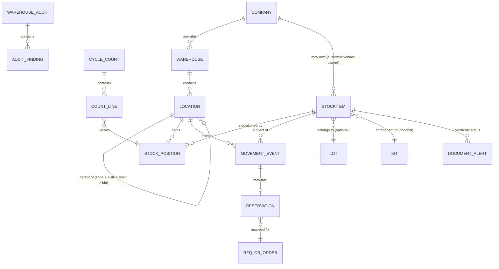

# Warehouse Module — Business & Architecture Design

Last updated: 2026-07-10
Role: Aviation Business Architect + Solutions Architect review. Documentation only. No Warehouse production code,
schema, API route, UI workflow, Yoyamic change, or deployment is implemented by this document.

## 1. Purpose & Scope

This document designs the future **Warehouse module** of `SaaS_Aviation/` before any implementation begins. It
answers three questions in order: what do the best aviation warehouse systems in the market already do, what
should SaaS_Aviation do generically for *any* aviation business (not just AeroCanada), and how does that design
snap onto the modules that already exist (Company 360, Part 360, Stock 360, Documents, and the transaction
modules that are still sample-only).

Warehouse is the **physical execution layer**. Stock 360 already answers "what do we have and who does it belong
to" as a read model; Warehouse answers "where physically is it, who touched it, and what physical process moved
it from one state to another." Today `StockItem.location` is a single flat optional string (see
`packages/shared/src/types.ts`) — the Warehouse module is what turns that string into a real physical model with
an auditable movement ledger, matching the lifecycle rule already codified in `BUSINESS_RULES.md`: *"Stock
movement must be explicit and auditable... require movement events with actor, timestamp, source document,
before/after state, and reason."* Nothing here was implemented in this sprint; this is the design that a future
implementation sprint should follow.

### 1.1 Why this matters now

`SaaS_Aviation/AVIATION_ERP_BENCHMARK.md` (2026-07-02) already flagged Warehouse & Logistics (WMS) as a
whole-module gap and called out, specifically on Stock 360, the absence of a bin/location hierarchy, reserved vs.
allocated vs. committed states, lot/batch tracking, incoming inspection, and landed cost. This document is the
direct follow-up: a complete, implementation-ready design for that gap, generalized beyond AeroCanada so it can
become the reusable Warehouse foundation for any tenant on the platform.

### 1.2 Who this must work for

The module must be equally correct for a broker who never touches a part physically (drop-ships from a supplier
straight to a customer), a distributor with one bonded warehouse, a repair station with quarantine and DG
storage requirements, an OEM shipping kits, a government/military depot with classified/export-controlled
material, and a stockist holding both owned and third-party-owned inventory in the same building. No field, state,
or workflow below may assume AeroCanada's specific business shape. Where AeroCanada-specific behavior is useful
(e.g. today's `ownerCompany`/`supplierCompany`/`tagInfoCompany`/`traceabilityCompany` split on `StockItem`), it is
treated as one configuration of a generic model, not the model itself.

---

## 2. Competitive Study — Reference Systems

Eight systems were studied, split into segments so the comparison is apples-to-apples (same method as
`AVIATION_ERP_BENCHMARK.md` §1):

| Segment | Systems | What they optimize for in the warehouse |
|---|---|---|
| **Parts trading / distribution / brokerage, materials-management-first** | Quantum Control (Component Control), Pentagon2000SQL | Traceability-first receiving, consignment/lot handling, certificate-gated availability, trading-desk speed |
| **MRO / CAMO execution, shop-floor-first** | Corridor, Ramco Aviation, Traxxall | Work-order-driven material issue/return, tool/consumable tracking, technician-facing stores counters |
| **Marketplace-and-portal-first parts trading** | AvSight (Salesforce-native) | Sales/quote velocity with inventory as a supporting object, not the primary UX |
| **Enterprise ERP backbone** | SAP (S/4HANA + aviation add-ons), IFS Cloud Aerospace & Defense | Multi-entity, multi-plant WMS, financial integration, regulatory governance at scale |

### 2.1 Quantum Control (Component Control)

**Strengths**
- Traceability is the organizing principle, not a bolt-on: every receipt, move, and issue is tied back to a
  trace/certificate chain. This is the single most copied idea across the market.
- Deep condition-code vocabulary (NE/NS/OH/SV/AR/RP and variants) drives both pricing and eligibility — a part in
  `AR` (as-removed) simply cannot be sold or shipped until it passes inspection and is recoded.
- Consignment and lot-purchase handling are first-class, not a workaround on top of owned-stock tables.
- Strong marketplace connectivity (ILS, PartsBase, SPEC2000/AeroXchange messaging) — receiving and shipping
  workflows are designed assuming the counterparty is another trading system, not just a human.

**Weaknesses**
- Bin/location UX is functional but dated; multi-warehouse transfer workflows require significant configuration
  to get right.
- Steep implementation and training cost — the traceability rigor that is its strength is also its onboarding
  tax.
- Weak in shop-floor/work-order execution (it is a trading-desk tool wearing MRO clothing, not the reverse).

**Missing / gaps**
- No native dangerous-goods classification workflow beyond flags — DG handling is largely procedural, outside
  the system.
- Limited mobile/handheld-native experience historically (improving, but not mobile-first architecture).

**Ideas worth adopting**
- Certificate-gated availability: a stock line cannot become `available` until its required certificate/trace
  record exists and passes validation. This is directly implementable against the Documents module already
  designed in `DOCUMENTS_ARCHITECTURE.md`.
- Condition code as a first-class dimension of the stock state, not free text.
- Trading-desk-speed receiving: minimize clicks between "box arrives" and "line is quarantined and visible,"
  because visibility (even in quarantine) is itself valuable to a trading business.

**Ideas to avoid**
- Do not let condition code and warehouse status become the same field — a part can be `OH` (overhauled) and
  simultaneously `reserved`, `quarantine`, or `available`. Keep them orthogonal (see §9).

### 2.2 Pentagon2000SQL

**Strengths**
- Unlimited-parts, lifetime part-revision control, and "instant retrieval of inventory location" are marketed
  as core design tenets — location lookup speed is treated as a first-class requirement, not an afterthought.
- Broad functional footprint: materials management, MRP, supply chain, maintenance, and QA in one system, so the
  warehouse module is never an island — it is wired into manufacturing/repair demand out of the box.
- Native support for outside repairs, exchanges, consigned inventory, and lot purchases, with a large aviation
  report library.
- On-prem or cloud deployment with iOS mobile apps and barcode scanning included, not a separate paid add-on
  ecosystem bolted on years later.
- Integrates with ILS, PartsBase, SPEC2000, and AeroXchange, same as Quantum Control — table stakes for a serious
  trading warehouse.

*(Source: Pentagon 2000 Software product materials, [pentagon2000.com](https://www.pentagon2000.com/product) and
[ERP Focus](https://www.erpfocus.com/pentagon-2000sql-erp-software-597.html).)*

**Weaknesses**
- Broad footprint means the warehouse module inherits the same "everything is configurable" complexity as the
  rest of the suite — implementation partners are effectively required.
- UI feels enterprise-dense; not a differentiator on ease-of-use, which is explicitly part of SaaS_Aviation's
  stated bar (`VISION.md`: *"the usability discipline of Salesforce and Odoo Enterprise"*).

**Missing / gaps**
- No emphasis in public materials on a modern REST/event API surface — integration tends to be file- or
  database-level rather than API-first, which does not fit SaaS_Aviation's adapter-first strategy.

**Ideas worth adopting**
- Lifetime part-revision control tied to location history: never delete or overwrite where a part has been —
  append, don't mutate (directly reusable for the movement-ledger design in §17).
- Treat "how fast can a user find where a specific serialized unit is right now" as a named, tested performance
  requirement, not an implicit one.

**Ideas to avoid**
- Do not let "materials management, MRP, maintenance, and QA in one system" become an excuse to blur module
  boundaries. SaaS_Aviation's mandate is the opposite: Warehouse exposes physical stock state; it does not own
  MRP, work orders, or QA nonconformance records, which stay separate modules with their own boundary panels
  (same discipline already applied to Part 360 vs. RFQ/Quotes/Orders).

### 2.3 AvSight

**Strengths**
- Built natively on Salesforce, so it inherits enterprise-grade permissions, workflow automation, and a modern
  UI framework essentially for free — the closest of the eight to SaaS_Aviation's own "Salesforce-grade
  usability" target.
- Strong CRM/quote/portal experience; inventory visibility is tightly wired into the sales funnel, so a rep sees
  live stock while quoting rather than switching systems.

**Weaknesses**
- Inventory/warehouse depth is secondary to its sales/CRM strength — bin-level and lot/batch granularity is
  thinner than Quantum Control or Pentagon2000.
- Dependent on the Salesforce platform's cost and governor limits at scale, which is a real constraint for
  warehouse-heavy, high-transaction-volume operations (millions of stock movements).

**Missing / gaps**
- No strong public signal of dedicated DG/shelf-life/temperature-storage tooling — likely handled via custom
  fields rather than a native model.

**Ideas worth adopting**
- Inventory visibility surfaced directly inside the sales/quote screen, not a separate tab a rep has to
  remember to check — directly relevant to how Part 360's stock panels should stay visible from RFQ/Quote
  screens once those modules exist.

**Ideas to avoid**
- Do not make warehouse depth an afterthought to commercial workflow. A trading business's margin depends on
  knowing exact condition/location/certificate status before quoting, not just quantity.

### 2.4 Corridor

**Strengths**
- Purpose-built for aviation *service* organizations — FBOs, repair stations, operators, MROs, and completion
  centers — with modules spanning Inventory Procurement & Logistics, Maintenance & Shop Management, Part Sales &
  Retail Distribution, and Aircraft Maintenance Record Keeping in one modular suite.
- Ties inventory directly to maintenance discrepancies: parts requests, purchase requests, and repair requests
  to OEMs/vendors are generated from the maintenance/AOG event itself, not created independently and then
  matched — a materially different (and for MRO-adjacent businesses, more correct) workflow direction than a
  pure trading system.
- Mobile, e-signature, and paperless workflow support is treated as core, not bolted on.

*(Source: [Corridor product overview](https://www.aero-nextgen.com/vendors/corridor) and
[G2 reviews](https://www.g2.com/products/corridor/reviews).)*

**Weaknesses**
- Optimized for shop-floor/maintenance-driven demand; a pure parts broker/distributor without a shop floor gets
  less value from its maintenance-record-keeping strength.
- Trading-desk speed (RFQ→quote→PO→SO velocity) is not its primary design center the way it is for Quantum
  Control/AvSight.

**Missing / gaps**
- Less public emphasis on multi-entity/multi-tenant SaaS architecture; historically deployed per-organization.

**Ideas worth adopting**
- Maintenance-event-driven material request: a repair/exchange workflow (already named in `VISION.md` as core to
  SaaS_Aviation) should be able to *pull* a warehouse reservation and, if unavailable, *push* a purchase request
  automatically — not require a human to notice the gap and manually create both records.
- Paperless/e-signature receiving and issue as a default expectation, not a premium feature.

**Ideas to avoid**
- Do not couple the warehouse data model to "there is always a work order behind this movement." SaaS_Aviation
  must support movements with no maintenance-record trigger at all (a pure trading sale, a straight consignment
  receipt) as the common case, with maintenance-driven movement as one *source* of a movement event, not the
  only one (see §17.7 Repair Return, which is deliberately designed as one workflow among many, not the anchor).

### 2.5 Ramco Aviation

**Strengths**
- Genuinely mobile-first and AI-forward (demand forecasting, predictive maintenance signals) — the strongest of
  the eight on modern architecture and analytics.
- Deep MRO/CAMO execution: work order material planning, tool calibration tracking, and technician mobile stores
  issue are best-in-class.
- Strong multi-entity, multi-currency, multi-country support out of the box — built for airline groups operating
  across borders.

**Weaknesses**
- Heaviest implementation footprint of the group; overkill for a pure trading business with no shop floor.
- Trading-desk/marketplace connectivity (ILS/PartsBase-style) is not its focus.

**Missing / gaps**
- Public materials emphasize execution over commercial trading workflow — a broker would still need bolt-ons for
  quote/RFQ velocity.

**Ideas worth adopting**
- Demand-forecast tiles feeding replenishment triggers directly from historical issue/consumption data — a
  natural fit for the "min/max stocking levels" gap already flagged in `AVIATION_ERP_BENCHMARK.md` §8 for
  Company Inventory.
- Tool/calibration tracking as its own sub-model of the warehouse (a tool is a special kind of serialized,
  location-tracked, expiry-tracked asset that is *loaned* to a work order and *returned*, never sold) — directly
  reusable pattern for §11 Loan states.

**Ideas to avoid**
- Do not require a work-order context to move stock. Ramco's strength (deep work-order integration) becomes a
  weakness if the data model assumes every movement traces to a work order — SaaS_Aviation's trading-first
  customers need frictionless movement with no work order at all.

### 2.6 Traxxall

**Strengths**
- Focused, CAMO/technical-records-first tool for business/general aviation operators — excellent at
  maintenance-due tracking, AD/SB compliance, and fleet-level airworthiness status.
- Lighter-weight and faster to deploy than the enterprise MRO suites, which matters for smaller operators.

**Weaknesses**
- Warehouse/inventory depth is the thinnest of the eight — it is a records/compliance tool first, an inventory
  system a distant second.
- Not designed for a trading/distribution business at all; a poor architectural template for warehouse *design*
  specifically, useful mainly as a negative example.

**Missing / gaps**
- No meaningful bin/lot/DG/shelf-life model to draw from.

**Ideas worth adopting**
- Its AD/SB and maintenance-due surfacing pattern is worth reusing *elsewhere* (Part 360's already-flagged LLP
  gap), even though it offers little for Warehouse specifically.

**Ideas to avoid**
- Do not let a compliance-records mindset substitute for real physical inventory control — knowing a part's
  paperwork is compliant is not the same as knowing which bin it is physically sitting in right now. Warehouse
  must own the latter as a hard, queryable fact, not an inference from documents.

### 2.7 SAP (S/4HANA + aviation extensions)

**Strengths**
- The reference for true enterprise-scale WMS: multi-plant, multi-warehouse, multi-currency, financial
  integration (landed cost, GL posting per movement type, intercompany transfer accounting) done correctly at
  massive scale.
- Extended Warehouse Management (EWM) has best-in-class support for wave picking, slotting optimization, and
  cross-docking — patterns worth knowing even if SaaS_Aviation does not need that scale on day one.
- Rigorous movement-type-driven GL posting: every physical movement has a corresponding accounting movement type,
  so inventory and finance never drift apart.

**Weaknesses**
- Enormous implementation cost and time; total overkill for the broker/distributor/small-MRO segment
  SaaS_Aviation is actually targeting first (per `VISION.md` and `AVIATION_ERP_BENCHMARK.md`'s own verdict).
- Configuration complexity is itself an operational risk — SAP WMS misconfiguration is a well-known cause of
  costly go-live failures industry-wide.

**Missing / gaps**
- Aviation-specific traceability/certificate concepts are add-ons, not native — SAP treats aerospace parts like
  any other serialized inventory unless heavily customized.

**Ideas worth adopting**
- Movement-type taxonomy: every stock movement should carry a `movementType` (receipt, put-away, pick, ship,
  transfer, adjustment-up, adjustment-down, quarantine-in, quarantine-release, consumption, return) that
  deterministically maps to both a physical effect and (later) an accounting effect. This directly informs the
  ledger design in §17.
- Strict separation between "unrestricted-use" and "quality-inspection" stock status, mirrored in Warehouse's own
  Quarantine/Inspection states (§11).

**Ideas to avoid**
- Do not build a general-purpose WMS platform before there is a real customer need for wave picking, slotting
  optimization, or cross-docking. Those are Tier 3+ capabilities (see §26) — building them prematurely is exactly
  the kind of complexity SAP is criticized for forcing onto smaller operators.

### 2.8 IFS Cloud Aerospace & Defense

**Strengths**
- Purpose-built aerospace & defense industry model on top of a genuine enterprise ERP core — closer to
  aviation-native than SAP, while retaining SAP-grade financial/manufacturing rigor.
- Strong export-control and government/military contract compliance tooling (ITAR/EAR awareness, classified
  material handling patterns) — the best of the eight for the "Government / Military" persona this module must
  support.
- Good multi-entity, multi-warehouse, multi-country support with configurable approval/segregation-of-duties
  workflow.

**Weaknesses**
- Same enterprise cost/complexity profile as SAP; not a fit for a lean broker/distributor as a day-one target.

**Missing / gaps**
- Less trading-desk speed focus than Quantum Control/AvSight — commercial velocity is not its primary design
  center.

**Ideas worth adopting**
- Export-control/classification awareness baked into the *part and stock* record itself (ECCN/USML-style
  classification), not bolted on as a company-level flag — directly reusable for the Government/Military persona
  and consistent with the already-flagged Part 360 export-classification gap in `AVIATION_ERP_BENCHMARK.md` §6.
- Segregation-of-duties on high-value/regulated movements (the person who counts a cycle count should not be the
  only approver reconciling it) — directly reusable for §17.10–§17.13.

**Ideas to avoid**
- Do not treat government/military as "the same as commercial but with an extra checkbox." Classified/controlled
  material handling needs its own access-restriction model at the location and stock-line level (§11.6), not a
  single boolean.

### 2.9 Cross-Cutting Synthesis

**The five ideas every reference system agrees on, worth adopting outright:**
1. Traceability and location are equally first-class — you must be able to answer "where is it" and "where has
   it been and under what certificate chain" with the same confidence.
2. Movement must be an appended, immutable event, never a silent field update (BUSINESS_RULES.md already commits
   SaaS_Aviation to this; every reference system enforces it operationally, several also enforce it
   structurally).
3. Condition/quality state and warehouse/location state are orthogonal dimensions, not one field.
4. Certificates gate availability — a stock line should not be sellable/shippable while a required document is
   missing or expired.
5. Mobile/barcode capture at the point of physical action (not backfilled later at a desk) is now table stakes,
   not a differentiator.

**The two anti-patterns every reference system's weak spot warns against, worth avoiding outright:**
1. Coupling the warehouse core to one demand source (a work order, a sales order, a maintenance event). The
   warehouse must support movement triggered by *any* upstream module, or none at all.
2. Letting implementation complexity scale ahead of actual customer need (SAP's classic failure mode). Design
   for the full model now (so the schema never needs a breaking change later), but build and expose the advanced
   capabilities (wave picking, slotting, RFID) only when a real tenant needs them (§26).

---

## 3. Design Principles

1. **Warehouse is a physical-state and movement-of-record system, not a commercial system.** It owns *where*,
   *how much*, *in what condition-adjacent state*, and *who moved it when and why*. It does not own price,
   quoting, ownership transfer terms, or commercial approval — those remain RFQ/Quotes/PO/SO/Repair/Exchange, all
   of which stay out of scope for this module per the sprint boundary already established for Part 360 and
   Company 360.
2. **Tenant- and vertical-agnostic by construction.** Every entity below is designed so an airline, MRO, OEM,
   repair station, stockist, broker, trader, distributor, government, or military tenant can configure it to
   their shape without a schema change — verticals differ in *which optional fields they populate and which
   workflows they enable*, not in the core model.
3. **One physical location model, many logical uses.** A bin is a bin whether it holds owned stock, consignment
   stock, a DG-classified part, or a quarantined unit — physical location and stock disposition are separate
   dimensions (§9, §10, §11) that compose, rather than a combinatorial explosion of "quarantine bin,"
   "consignment bin," etc.
4. **Everything is derived from an append-only movement ledger.** Current location, current status, and current
   quantity are always *materialized views* over the ledger (§17), never the primary source of truth — this is
   what makes cycle counts, audits, and "how did this get here" questions answerable without guesswork, and it is
   the direct implementation of the `BUSINESS_RULES.md` lifecycle rule.
5. **Certificates gate physical availability, but Warehouse does not own certificates.** Warehouse reads
   certificate/document status from the Documents module (already designed in `DOCUMENTS_ARCHITECTURE.md`) to
   decide whether a receiving line may leave quarantine — it never stores document bytes or reimplements
   validation.
6. **Reserved ≠ Allocated ≠ Committed ≠ On Hold ≠ Quarantine.** Five genuinely different reasons a unit is not
   "available" must remain five distinct, independently reportable states (§10), because they have different
   owners, different release conditions, and different urgency.
7. **Read models aggregate; Warehouse itself does not duplicate Part 360 / Stock 360 / Company 360 business
   logic.** Warehouse publishes location/movement facts; Stock 360 and Part 360 continue to be the place a human
   looks to understand a part or stock line holistically, now enriched with real location/movement data instead
   of a flat string.
8. **Multi-tenant and multi-warehouse from day one, at the schema level — not multi-tenant "later."** Every
   entity carries `tenantId`; every location carries `warehouseId`; every warehouse carries `companyId` (the
   legal entity that operates it, which may differ from the tenant's primary company once multi-entity tenancy
   exists per the Auth/Tenant foundation's already-known gap).
9. **No fake workflows.** Anything not implemented yet is a workflow-boundary panel, exactly as already
   established for Part 360/Company 360/Stock 360 — this document describes what those boundary panels should
   eventually become, not a promise that they exist today.

---

## 4. Domain Model Overview

This diagram is descriptive, not a schema — see §9–§16 for full field-level tables.

---

## 5. Core Entities

### 5.1 Warehouse

The top-level physical facility. A tenant may operate many; a warehouse belongs to exactly one legal entity
(`companyId`) and one tenant.

| Field | Type | Notes |
|---|---|---|
| `id` | string | |
| `tenantId` | TenantId | Required on every query, per existing pattern. |
| `companyId` | string | The operating legal entity — usually the tenant's primary company, but distinct once multi-entity tenancy exists. |
| `code` | string | Short human code (e.g. `WH-MIA`, `WH-01`) — this is the natural key ops staff use verbally. |
| `name` | string | |
| `type` | `"bonded" \| "general" \| "quarantine-only" \| "consignment-only" \| "field-stores" \| "mobile" \| "virtual-dropship"` | `virtual-dropship` supports brokers who never take physical possession — see §5.6. |
| `address` | Address (street/city/state/postalCode/country) | |
| `timezone` | string | Warehouses in different countries need their own operating-hours/timezone for accurate movement timestamps. |
| `country` | string (ISO 3166-1 alpha-2) | Drives export-control and DG-regulation applicability (§14). |
| `customsBondNumber` | string? | For bonded warehouses — relevant to landed-cost and duty-deferral accounting later. |
| `certifications` | string[] | e.g. `AS9100`, `FAA Repair Station No. XXXXXX`, `EASA Part-145 Approval No. XXXXX` — a warehouse may itself hold accreditations that gate which work can happen in it. |
| `status` | `"active" \| "inactive" \| "closed"` | |
| `defaultReceivingLocationId` | string? | Where unassigned receipts land before put-away. |
| `defaultQuarantineLocationId` | string? | |

### 5.2 Location (hierarchical: Zone → Aisle/Row → Shelf → Bin)

Locations form a self-referencing tree under a warehouse. This directly replaces `StockItem.location: string`.

| Field | Type | Notes |
|---|---|---|
| `id` | string | |
| `tenantId` | TenantId | |
| `warehouseId` | string | |
| `parentLocationId` | string? | Null at the top of the tree (a Zone). |
| `level` | `"zone" \| "aisle" \| "shelf" \| "bin"` | Fixed 4-level hierarchy keeps queries and UI simple; a tenant that does not need all four levels simply skips ranks (a bin can hang directly off a zone). |
| `code` | string | Full human-readable path is derived, e.g. `WH-MIA / Z-A / A-03 / S-2 / B-14`. |
| `barcode` | string? | Printed/scanned location label — see §16. |
| `capacityUnits` | number? | Optional slotting capacity for future pick optimization (§2.7 SAP idea, not built day one). |
| `locationClass` | `"general" \| "quarantine" \| "dangerous-goods" \| "temperature-controlled" \| "high-value-cage" \| "consignment" \| "customer-owned-segregation" \| "classified-restricted"` | A location's *class* constrains what may be put away there — see §11, §14, §15. |
| `temperatureRangeC` | {min, max}? | Required if `locationClass = temperature-controlled`. |
| `accessRestriction` | `"none" \| "supervisor-only" \| "cleared-personnel-only"` | Directly implements the IFS-inspired classified-material idea from §2.8. |
| `active` | boolean | |

### 5.3 Stock Position

The *current* materialized location of a stock line/serial/lot — always derivable by replaying `MovementEvent`s,
but persisted as a read-optimized table because "where is X right now" is the single most frequent Warehouse
query.

| Field | Type | Notes |
|---|---|---|
| `id` | string | |
| `tenantId` | TenantId | |
| `stockItemId` | string | FK to the existing `StockItem` (Stock 360). |
| `locationId` | string | |
| `qty` | number | Qty `0` remains meaningful and visible, per existing business rule — a position record is not deleted just because its qty reaches zero if there is history/audit value in it; it is closed (see `positionStatus`). |
| `lotId` | string? | |
| `serialNumber` | string? | Denormalized from `StockItem` for fast location-by-serial lookup. |
| `positionStatus` | `"open" \| "closed"` | `closed` when qty is fully moved out; retained for audit trail rather than deleted. |
| `lastMovementEventId` | string | Points at the ledger entry that produced this row — the audit thread. |
| `lastCountedAt` | string? | Last cycle count / physical inventory verification timestamp — see §17.10–11. |

### 5.4 Movement Event (the ledger)

Append-only. Every put-away, pick, transfer, adjustment, quarantine action, and count correction is one row here.
Nothing about current state is ever mutated in place — a correction is a new, opposite event, never an edit.

| Field | Type | Notes |
|---|---|---|
| `id` | string | |
| `tenantId` | TenantId | |
| `stockItemId` | string | |
| `movementType` | see §17 taxonomy | Receipt, put-away, pick, pack, ship, transfer-out, transfer-in, quarantine-in, quarantine-release, adjustment-up, adjustment-down, count-correction, hold-in, hold-release, repair-out, repair-in, exchange-out, exchange-in, loan-out, loan-in, consumption, scrap. |
| `fromLocationId` | string? | Null for a pure receipt. |
| `toLocationId` | string? | Null for a pure shipment/consumption/scrap. |
| `qty` | number | Always positive; direction is implied by `movementType`. |
| `lotId` / `serialNumber` | string? | |
| `actorUserId` | string | Required — matches `BUSINESS_RULES.md`'s "actor" requirement. |
| `occurredAt` | ISO date | |
| `sourceDocumentType` | `"receiving" \| "shipment" \| "transfer-order" \| "cycle-count" \| "physical-inventory" \| "adjustment" \| "repair-order" \| "exchange-order" \| "loan-agreement" \| "rfq" \| "sales-order" \| "purchase-order" \| "manual"` | Matches `BUSINESS_RULES.md`'s "source document" requirement — and deliberately includes `rfq`/`sales-order`/`purchase-order` as *possible* triggers without requiring one, per §2.9's anti-pattern warning. |
| `sourceDocumentId` | string? | |
| `reason` | string | Required for adjustments/holds/quarantine actions; matches `BUSINESS_RULES.md`'s "reason" requirement. |
| `beforeState` | embedded snapshot | Status/location/qty before — matches `BUSINESS_RULES.md`'s "before/after state" requirement. |
| `afterState` | embedded snapshot | Status/location/qty after. |
| `approvedByUserId` | string? | Populated when the movement type requires segregation-of-duties approval (§17.11–13, §26 Tier 2). |

### 5.5 Reservation

Distinct from a `StockPosition` — a reservation is a *claim* against available quantity, not a location.

| Field | Type | Notes |
|---|---|---|
| `id` | string | |
| `tenantId` | TenantId | |
| `stockItemId` | string | |
| `qty` | number | |
| `reservationType` | `"reserved" \| "allocated" \| "committed"` | See §10.2 for the precise distinction. |
| `sourceType` | `"rfq" \| "sales-order" \| "work-order" \| "transfer-order" \| "manual-hold"` | |
| `sourceId` | string | |
| `expiresAt` | string? | Reserved-for-quote claims should expire; allocated/committed against a confirmed order typically should not. |
| `createdByUserId` | string | |
| `releasedAt` | string? | Null while active. |
| `releaseReason` | string? | |

### 5.6 Ownership Overlay (Customer-owned / Vendor-owned / Consignment)

Ownership is **not** a Warehouse-owned concept — it already exists on `StockItem` (`ownerCompany`), and Company
360/Stock 360 already keep owner, supplier, tag-info, and traceability company independent, per
`BUSINESS_RULES.md`. Warehouse's job is to make ownership *storage-visible*: a location's `locationClass` can be
set to `customer-owned-segregation` or `consignment`, and put-away rules (§17.3) should refuse to co-mingle two
different owning companies' serialized units in the same bin unless the tenant explicitly allows commingling for
fungible/lot-tracked consumables. `virtual-dropship` warehouses (§5.1) exist specifically for the broker case
where the tenant never holds physical custody at all — a `StockPosition` can exist at a virtual warehouse purely
to represent "this unit is at Supplier X's dock, contractually reserved for us," so Part 360/Stock 360 still show
a coherent location even when nothing physically sits on AeroCanada's (or any tenant's) shelf.

### 5.7 Lot / Batch

| Field | Type | Notes |
|---|---|---|
| `id` | string | |
| `tenantId` | TenantId | |
| `lotNumber` | string | Human-facing identifier, supplier- or internally-assigned. |
| `partId` | string | FK to `PartNumber`. |
| `receivedQty` | number | |
| `remainingQty` | number | Derived from open `StockPosition`s, denormalized for fast lookup. |
| `manufactureDate` / `cureDate` | string? | Consumables with shelf life. |
| `expiresAt` | string? | See §15. |
| `supplierCompanyId` | string | |
| `certificateDocumentIds` | string[] | Pointers into Documents. |

### 5.8 Kit

A kit is a defined bill-of-parts sold/issued as one unit, but composed of individually traceable stock lines.

| Field | Type | Notes |
|---|---|---|
| `id` | string | |
| `tenantId` | TenantId | |
| `kitPartId` | string | The "virtual" part number representing the kit itself. |
| `components` | {partId, qtyPerKit, substitutesAllowed}[] | Bill of materials. |
| `assembledStockItemId` | string? | If pre-assembled and held as its own serialized/lotted stock line. |
| `assemblyMovementEventIds` | string[] | Links to the movement events that consumed components into the kit — kits never destroy traceability of their components. |

### 5.9 Dangerous Goods Profile (attached to `PartNumber` or `Lot`)

| Field | Type | Notes |
|---|---|---|
| `isDangerousGoods` | boolean | |
| `unNumber` | string? | UN number per IATA DGR / ICAO Technical Instructions. |
| `hazardClass` | string? | IATA DGR hazard class. |
| `packingGroup` | string? | |
| `packingInstruction` | string? | e.g. IATA DGR PI 650-style reference. |
| `requiresSegregationFrom` | string[]? | Other hazard classes that cannot share a location. |
| `handlerCertificationRequired` | boolean | Gates which `actorUserId`s may perform DG movements — ties to a future user-certification model already flagged as a gap in `AVIATION_ERP_BENCHMARK.md` §3. |

### 5.10 Warehouse Audit / Cycle Count / Physical Inventory

| Field | Type | Notes |
|---|---|---|
| `id` | string | |
| `tenantId` | TenantId | |
| `warehouseId` | string | |
| `kind` | `"cycle-count" \| "physical-inventory" \| "spot-audit"` | |
| `scope` | `"location" \| "part" \| "warehouse-wide"` | |
| `scheduledFor` | string | |
| `status` | `"scheduled" \| "in-progress" \| "pending-approval" \| "closed"` | |
| `countedByUserId` | string | |
| `approvedByUserId` | string? | Segregation-of-duties: counter ≠ approver for variance write-offs above a configurable threshold (§2.8 idea). |
| `lines` | CountLine[] | See below. |

**CountLine**

| Field | Type | Notes |
|---|---|---|
| `stockPositionId` | string | |
| `systemQty` | number | Snapshot at count time. |
| `countedQty` | number | |
| `variance` | number | Derived. |
| `varianceReason` | string? | Required if variance ≠ 0. |
| `resultingMovementEventId` | string? | The `count-correction` ledger entry, once approved. |

---

## 6. Stock Disposition States (orthogonal to location)

Per §2.1/§2.7's cross-cutting lesson, condition and warehouse status are two separate axes. Warehouse owns the
**disposition** axis:

| Disposition | Meaning | Who can move it out |
|---|---|---|
| `receiving` | Physically arrived, not yet inspected. | Inspection workflow only. |
| `quarantine` | Failed or pending inspection/certificate verification. | Quarantine Release workflow only (§17.14). |
| `available` | Passed inspection, certificate-complete, free to reserve/sell/issue. | Any reservation/pick workflow. |
| `reserved` | Soft-claimed against an RFQ/quote; not yet confirmed. Time-boxed. | Auto-releases on expiry or explicit release. |
| `allocated` | Claimed against a confirmed order, not yet picked. | Pick workflow, or explicit deallocation. |
| `committed` | Picked/packed, awaiting shipment — physically set aside. | Ship workflow only. |
| `on-hold` | Manually frozen (legal, credit, quality, dispute) regardless of condition. | Explicit hold-release with reason, by an authorized role. |
| `in-repair` | Sent to a vendor/shop; physically off-site. | Repair Return workflow (§17.7). |
| `in-exchange` | Out on an exchange program. | Exchange workflow (§17.8). |
| `on-loan` | Out on loan/tool-loan; expected back, not sold. | Loan return workflow. |
| `on-lease` | Out on lease; ownership stays with the lessor tenant/company. | Lease return workflow. |
| `consumed` | Issued to a work order / kit and no longer independently trackable as a unit. | Terminal — reversible only via `scrap`/`consumption` reversal, audited. |
| `scrapped` | Removed from usable inventory permanently. | Terminal, requires approval per §17.13. |

This directly resolves the `reserved` vs. `allocated` vs. `committed` gap flagged in `AVIATION_ERP_BENCHMARK.md`
§7, and keeps `EntityStatus` (the existing `packages/shared/src/types.ts` enum used across Stock 360/Part 360
today) as the *commercial* status a human sees, while `disposition` above is the *warehouse* status a movement
event transitions.

---

## 7. Serialization & Identification

- **Serial number** — one unit, one identity, tracked individually for the unit's entire life (already partially
  modeled via `StockItem.serialNumber`). Warehouse's `StockPosition` and `MovementEvent` both carry
  `serialNumber` so "where has SN X been, always" is a single ledger query.
- **Lot/batch** — a group of fungible units sharing manufacture/cure/expiry data (consumables, hardware,
  chemicals). Individually unserialized, but the *lot* is traced as a unit (§5.7).
- **Barcode / QR** — every `Location` and every serialized `StockPosition`/`Lot` receives a printable
  barcode/QR label. Receiving, put-away, pick, and cycle count workflows are all designed around "scan location,
  scan part/serial, confirm quantity" as the default interaction, not typing.
- **Future RFID** — the data model already supports it without a schema change: RFID is simply another
  `identifierType` alongside barcode/QR on the same physical entities, resolved by a scan event rather than a
  different one. Not built day one (§26 Tier 3) — no RFID hardware integration exists yet.
- **Future handheld scanners / mobile app** — the workflows in §17 are written scan-event-first specifically so a
  future handheld/mobile client is a *new UI* over the same movement-event API, not a redesign. This mirrors the
  adapter-first strategy already used for the legacy Yoyamic migration.

---

## 8. Workflows

Each workflow below lists: trigger, actors, steps, states touched, data captured, and exceptions. All are
currently **out of scope for implementation** — this is the specification a future sprint should build against.
Every workflow ends by writing one or more `MovementEvent` rows; none of them ever silently update
`StockPosition` without one.

### 8.1 Receiving

- **Trigger:** Physical goods arrive (against a PO, a consignment agreement, a repair return, a customer
  drop-off, or unsolicited).
- **Actors:** Warehouse receiving clerk.
- **Steps:** (1) Scan/enter source document if one exists (PO, RMA, consignment agreement) or mark as
  undocumented receipt (flagged for follow-up). (2) Record piece count, packaging condition, and any visible
  damage. (3) Capture accompanying paperwork into Documents (certificates, packing slip, airway bill) — this
  creates `DocumentAlert`/`DocumentLink` rows, not new Warehouse entities. (4) System creates `StockItem` (if new)
  or matches to existing part/lot, and writes a `receipt` `MovementEvent` from `null` to the warehouse's default
  receiving location, disposition = `receiving`.
- **States touched:** `receiving`.
- **Exceptions:** Quantity mismatch vs. source document → flagged, does not block physical receipt but blocks
  disposition progression past `receiving`. Damaged packaging → routed directly to Inspection with a damage flag.

### 8.2 Inspection

- **Trigger:** Any line in `receiving` disposition, or a scheduled recurring inspection (shelf-life/DG
  spot-checks).
- **Actors:** Quality/inspection role (may require a specific certification per §5.9).
- **Steps:** (1) Verify physical condition against expected condition code. (2) Verify certificate/document
  presence and validity via the Documents module (certificate-gated availability, §2.1/§3.5). (3) Pass → move to
  `available` (or `on-hold` if a commercial hold applies) and route to Put Away. Fail → move to `quarantine` with
  a required reason.
- **States touched:** `receiving` → `available` or `quarantine`.
- **Exceptions:** Missing/expired certificate always fails to `quarantine`, never `available`, regardless of
  physical condition — this is the certificate-gate rule from §2.1, made a hard workflow constraint.

### 8.3 Put Away

- **Trigger:** A line reaches `available` (or is deliberately put away while still `quarantine`, into a
  DG/quarantine-classed location).
- **Actors:** Warehouse operative (or automated slotting suggestion, future).
- **Steps:** (1) System suggests a location based on `locationClass` compatibility (DG parts must go to a
  `dangerous-goods` location; consignment stock defaults to `consignment`/`customer-owned-segregation`
  locations). (2) Operative scans destination bin, confirms. (3) `put-away` `MovementEvent` written from the
  receiving/staging location to the final bin.
- **States touched:** Location only; disposition unchanged.
- **Exceptions:** Location class mismatch (e.g. scanning a DG part into a `general` bin) blocks confirmation
  unless explicitly overridden by a supervisor role, which is itself logged as an exception event.

### 8.4 Pick

- **Trigger:** A `Reservation` transitions from `allocated` to being fulfilled (order confirmed for shipment,
  work order material issue approved, transfer order released).
- **Actors:** Warehouse operative.
- **Steps:** (1) System generates a pick list (single or wave, §26 Tier 3 for wave). (2) Operative scans bin,
  scans/confirms part+serial/lot, confirms quantity. (3) `pick` `MovementEvent` written from the bin to a staging
  location; disposition moves `allocated` → `committed`.
- **States touched:** `allocated` → `committed`.
- **Exceptions:** Short-pick (bin has less than expected) triggers an immediate discrepancy flag and, if the
  variance can't be resolved from another location, kicks back to the reserving workflow (RFQ/SO/work-order) as a
  shortage — Warehouse does not silently substitute another serial/lot without an explicit substitution rule.

### 8.5 Pack

- **Trigger:** All pick lines for one shipment are in `committed` disposition at the staging location.
- **Actors:** Warehouse operative.
- **Steps:** (1) Verify contents against the pick list. (2) Attach/print shipping documents, DG paperwork if
  applicable (IATA DGR shipper's declaration), and certificates/trace packages requested for the customer. (3)
  Capture package-level identifiers (tracking number, weight, dimensions) for the shipment record.
- **States touched:** None (disposition stays `committed`) — packing is a documentation/physical step, not a
  location or disposition change, though a `pack` movement event is still written for audit completeness (bin →
  outbound-staging, if distinct locations are used).
- **Exceptions:** DG paperwork missing/incomplete blocks packing completion — hard stop, not a warning, matching
  IATA DGR requirements.

### 8.6 Ship

- **Trigger:** Carrier pickup / dispatch confirmed.
- **Actors:** Warehouse operative / shipping clerk.
- **Steps:** (1) Confirm carrier and tracking. (2) `ship` `MovementEvent` written from outbound-staging to
  `null` (stock leaves the warehouse's tracked inventory); disposition moves to `consumed` for a sale, or to
  `in-repair`/`in-exchange`/`on-loan`/`on-lease` for those specific movement types (§8.7–§8.9). (3) The
  corresponding `Reservation` is closed.
- **States touched:** `committed` → terminal-or-off-site state.
- **Exceptions:** Carrier pickup fails/cancelled → line reverts to `committed` at the staging location, no ledger
  reversal needed since nothing left custody yet.

### 8.7 Internal Transfer

- **Trigger:** Rebalancing stock between two of the tenant's own warehouses/locations, or moving stock into/out
  of a segregation class (e.g. a unit is reclassified as DG after a lot re-test).
- **Actors:** Warehouse operative at both ends, or one operative for same-warehouse transfers.
- **Steps:** (1) `transfer-out` event at the source (disposition may move to a transient `in-transit` marker or
  stay `available` with a location-only change for same-warehouse moves). (2) `transfer-in` event at the
  destination on receipt confirmation.
- **States touched:** Location; disposition typically unchanged for intra-warehouse moves.
- **Exceptions:** Cross-country transfers must check export-control/customs applicability before release — this
  workflow is the natural hook for the export-screening gate already flagged at the Company 360 level in
  `AVIATION_ERP_BENCHMARK.md` §5, now also enforced at the part/movement level per the IFS-inspired idea in §2.8.

### 8.8 Repair Return

- **Trigger:** A unit in `in-repair` disposition physically returns from the vendor/shop.
- **Actors:** Receiving clerk, then Inspection.
- **Steps:** Re-enters through Receiving (§8.1) referencing the original repair order as the source document, then
  Inspection (§8.2) — a repaired unit is never assumed airworthy without re-inspection and re-verification of the
  returned certificate (8130-3/Form 1/CoC), even though it left the building already certified once.
- **States touched:** `in-repair` → `receiving` → `available`/`quarantine`.
- **Exceptions:** Core/exchange-value discrepancy (returned core condition worse than expected) is flagged for
  the commercial Repair module (out of Warehouse's scope) but the physical receipt/inspection still proceeds.

### 8.9 Exchange (outbound and inbound core return)

- **Trigger:** An exchange transaction is confirmed by the (future) Exchange module.
- **Actors:** Warehouse operative.
- **Steps:** Outbound leg follows Pick/Pack/Ship (§8.4–8.6) with `movementType = exchange-out`. The expected core
  return is tracked as an open `Reservation` of type `allocated` against an inbound exchange, so the warehouse
  can proactively flag overdue cores. Inbound core return follows Receiving → Inspection exactly like a Repair
  Return, referencing the exchange agreement as source document.
- **States touched:** `available`/`committed` → `in-exchange` (outbound); `in-exchange` (elsewhere) →
  `receiving` → `available`/`quarantine` (inbound core).
- **Exceptions:** Core not returned by the agreed date surfaces as an exception on the open reservation — this is
  the natural feed for a future dashboard "overdue exchange cores" tile, extending the existing
  `serviceWorkflows` (`ServiceWorkflowSummary`, kind `exchange`) already in `packages/shared/src/types.ts`.

### 8.10 Cycle Count

- **Trigger:** Scheduled (e.g. high-value/high-velocity bins counted weekly, low-velocity monthly) or ad hoc.
- **Actors:** Counter (warehouse operative), Approver (different person, per SoD principle from §2.8).
- **Steps:** (1) System generates a `WarehouseAudit` of kind `cycle-count` with a scoped set of `StockPosition`s.
  (2) Counter scans each location/serial/lot and records counted qty — blind count, system qty is not shown to
  the counter to avoid confirmation bias. (3) Variances above a configurable threshold require the Approver to
  review before a `count-correction` `MovementEvent` is written.
- **States touched:** Any — a correction can move qty, or flip disposition (e.g. counter finds a unit physically
  in `quarantine` shelving that the system still shows `available`).
- **Exceptions:** Repeated variance on the same bin/part triggers a `spot-audit` escalation automatically.

### 8.11 Physical Inventory

- **Trigger:** Scheduled (annual/period-end), or regulatory/insurance-driven.
- **Actors:** Whole-warehouse count team, Approver/controller sign-off.
- **Steps:** Same mechanics as Cycle Count but `scope = warehouse-wide`, typically with warehouse operations
  paused or restricted during the count window, and a formal closing sign-off required before any further
  movement events are accepted against counted locations.
- **States touched:** Any.
- **Exceptions:** Material variance vs. book value is a finance-facing exception, not just a Warehouse one — this
  is the natural future integration point with Accounting (§9.10).

### 8.12 Inventory Adjustment

- **Trigger:** A correction outside the cycle-count/physical-inventory process (e.g. found damaged stock,
  data-entry correction, write-off).
- **Actors:** Authorized role only; requires approval above a configurable value threshold (SoD, §2.8).
- **Steps:** (1) Reason and supporting reference required (matches `BUSINESS_RULES.md`). (2) `adjustment-up` or
  `adjustment-down` `MovementEvent` written directly, without a full count workflow.
- **States touched:** Quantity; optionally disposition (e.g. adjusting a unit straight to `scrapped`).
- **Exceptions:** None bypass the approval gate — this is deliberately the highest-friction workflow in the
  module, since it is the one most exposed to error or fraud if left ungated.

### 8.13 Warehouse Audit

- **Trigger:** Scheduled compliance audit (internal QA, AS9100/AS9120 surveillance audit, customer audit).
- **Actors:** Auditor role (may be external/read-only), warehouse manager.
- **Steps:** (1) Auditor reviews a sample of `MovementEvent` chains end-to-end (receipt → inspection → put-away →
  ... → current state) for completeness and certificate linkage. (2) Findings recorded as `AuditFinding` rows
  against the `WarehouseAudit`, each optionally linked to a specific `MovementEvent` or `Location`.
- **States touched:** None directly — this is a read/reporting workflow over the existing ledger, proving the
  ledger design itself is the audit trail, not a separate system.
- **Exceptions:** Findings requiring corrective action generate a follow-up task, out of Warehouse's own scope
  (future QMS/CAPA module, already flagged as a whole-module gap in `AVIATION_ERP_BENCHMARK.md` §9).

### 8.14 Quarantine Release

- **Trigger:** A unit in `quarantine` disposition either passes a deferred inspection or has its blocking issue
  resolved (certificate obtained, damage repaired and re-inspected, hold reason cleared).
- **Actors:** Quality/inspection role; may require a second approver for high-value or DG lines (SoD).
- **Steps:** (1) Re-verify the original quarantine reason is resolved. (2) `quarantine-release` `MovementEvent`
  written; disposition moves to `available` (or `scrapped` if the resolution is "cannot be released, write off").
- **States touched:** `quarantine` → `available` or `scrapped`.
- **Exceptions:** Cannot release without a documented resolution reason — an empty/expired certificate cannot be
  waived without a compensating record (e.g. a new certificate obtained, logged as the linked document).

---

## 9. Relationships / Integration Map

Warehouse **exposes** physical facts; it does not reach into and mutate any other module. Every relationship
below is read-and-publish, matching the exact boundary discipline already used for Part 360/Company 360/Stock
360.

| Module | Relationship |
|---|---|
| **Stock 360** | Warehouse is the physical backing store for `StockItem.location`. Stock 360 continues to be the human-facing 360 view; it now reads real `StockPosition`/`MovementEvent` data instead of a flat string, and its existing `reservation`/`movement`/`upload` boundary panels (already scaffolded per `docs/business/stock.md`) become real actions calling into Warehouse. |
| **Part 360** | Part 360's Internal/External Stock panels (already built, see `docs/business/part-360.md`) read `StockPosition` for real location detail per row instead of the current flat `location` string, and its "Add Stock" boundary action becomes the entry point into Receiving (§8.1). |
| **Company 360** | A company's inventory relationship (owner/supplier/tag-info/traceability, already modeled) is unaffected — Warehouse adds *where physically* that relationship's stock sits, feeding the existing Company Inventory read model with location detail instead of changing its ownership logic. |
| **Documents** | Warehouse *reads* certificate/document status to gate Inspection (§8.2) and Quarantine Release (§8.14), and *writes* new document links for receiving paperwork, DG shipper's declarations, and count/audit reports — using the existing `DocumentLink`/`DocumentOwnerModule` pattern, which should gain a `warehouse-movement` or `warehouse-audit` owner-module value when implemented. It never stores bytes itself. |
| **RFQ** | An RFQ may create a `Reservation` (`reservationType = reserved`) against available stock to support a quote's promised availability — released automatically if the RFQ closes without an order. |
| **Supplier Quotes** | No direct Warehouse relationship until a PO is confirmed — supplier quotes are commercial, pre-physical. |
| **Customer Quotes** | Same as RFQ — a quote may soft-reserve stock to protect the quoted price/availability window; expires with the quote. |
| **Purchase Orders** | A confirmed PO is the expected source document for a future Receiving event (§8.1) and may pre-allocate a receiving location/DG handling requirement ahead of physical arrival. |
| **Sales Orders** | A confirmed SO converts a `reserved` reservation to `allocated`, triggering Pick (§8.4) once released for fulfillment. |
| **Repair** | Repair send-out and return map directly to `in-repair` disposition and the Repair Return workflow (§8.8); the Repair module owns the commercial/vendor-management side, Warehouse owns the physical custody chain. |
| **Exchange** | Maps to §8.9 exactly as described — commercial terms stay in the Exchange module, physical custody and core-return tracking stay in Warehouse. |
| **Accounting** | Warehouse does not post to the GL directly, but every `MovementEvent`'s `movementType` is designed (per the SAP-inspired idea in §2.7) to map deterministically to a future accounting movement type — this is the seam a future Accounting integration plugs into, without Warehouse needing to know anything about GL codes itself. |
| **AI** | Two natural, non-invasive AI surfaces once the ledger exists: (1) demand-forecast/replenishment suggestions from historical `MovementEvent` consumption patterns (the Ramco-inspired idea, §2.5), feeding the existing Company Inventory min/max gap; (2) anomaly detection on the ledger itself (unusual adjustment patterns, repeated cycle-count variance on the same bin/actor) as a QA/fraud-risk signal. Both are read-only consumers of the ledger, never a decision-maker that writes movement events autonomously. |
| **Multi-tenant** | Every entity in §5 carries `tenantId`; every `Location` additionally scopes through `warehouseId → companyId`, so a tenant with multiple legal entities (once multi-entity tenancy exists, already a known gap in Auth/Tenant) can still isolate warehouses per entity within one tenant. |

---

## 10. Permissions, Multi-Tenant & Scalability

### 10.1 Tenant Isolation

Identical pattern to every other module already built: every read and write requires `RequestContext`, every
query filters by `tenant.tenantId` before any join, and cross-tenant references (e.g. a consignment relationship
between two different tenants' companies) are resolved through the existing `Company`/business-relationship
layer, never by relaxing Warehouse's own tenant filter.

### 10.2 Role Model (extends the existing `Role`/`Permission` types)

New permissions this module will eventually need, additive to `packages/shared/src/types.ts`'s existing
`Permission` union (not a replacement):

- `warehouse.read` — view locations, positions, movement history.
- `warehouse.receive` — perform Receiving.
- `warehouse.inspect` — perform Inspection/Quarantine Release (may itself be gated by a certification flag on
  the user, per §5.9).
- `warehouse.move` — perform Put Away/Transfer/Pick/Pack/Ship.
- `warehouse.adjust` — perform Inventory Adjustment (high-privilege).
- `warehouse.count` — perform Cycle Count/Physical Inventory as counter.
- `warehouse.approve` — approve adjustments/counts/DG movements above threshold (SoD approver role, distinct
  from `warehouse.adjust`/`warehouse.count` so the same user cannot both act and approve).
- `warehouse.audit` — read-only, cross-location audit access (may be granted to an external/customer auditor
  role without granting operational permissions).

### 10.3 Scalability Targets

Designed for: millions of parts, millions of stock lines, many warehouses per tenant, many countries, many
companies, many tenants. Concretely:

- **`MovementEvent` is the highest-volume table by design** (one row per physical action, potentially tens of
  rows per stock line over its life). It must be append-only, time-partitioned (e.g. by `occurredAt` month), and
  indexed on `(tenantId, stockItemId, occurredAt)` and `(tenantId, locationId, occurredAt)` as the two dominant
  query shapes ("history of this unit" and "history of this bin").
- **`StockPosition` is the hot-path read table** — "where is X right now" must be O(1) indexed lookup
  (`tenantId, stockItemId` and `tenantId, locationId, positionStatus = open`), never a ledger replay at read
  time. The ledger is the source of truth; the position table is a materialized, eventually-consistent (but
  practically synchronous) projection, rebuildable from the ledger if it ever drifts — exactly the SAP-inspired
  "movement type deterministically produces state" discipline from §2.7.
- **Location tree depth is fixed at 4 levels** specifically so path queries and breadcrumb rendering stay O(1)
  rather than requiring recursive tree traversal at arbitrary depth.
- **Multi-warehouse and multi-country are first-class dimensions on `Warehouse`/`Location`, not inferred** — a
  tenant with 200 warehouses across 40 countries must be able to filter/report by warehouse, country, or company
  without a schema workaround.
- **Multi-tenant scale**: identical tenant-partitioning discipline as every existing module — no shared mutable
  state, no cross-tenant table scans, `tenantId` on every index's leading column for warehouse-scoped queries.
- **Caching**: `StockPosition` current-state reads are the highest-frequency query (every Part 360/Stock 360 page
  view) and are the natural candidate for a short-TTL cache layer once real (non-sample) data exists, invalidated
  on new `MovementEvent` writes for the affected `stockItemId`/`locationId`.

---

## 11. Security & Compliance

- **Export control**: `Warehouse` inherits and extends the export-classification gap already flagged for Part
  360 (`AVIATION_ERP_BENCHMARK.md` §6) — a Transfer (§8.7) crossing a country boundary must check the part's
  ECCN/USML classification and the destination country against denied-party/export-control rules before release,
  the same gate already recommended at the Company 360 level, now enforced at the point of physical movement too.
- **Classified/restricted material**: `Location.accessRestriction` and per-user certification/clearance (a known
  gap already flagged at the Auth/Tenant level in `AVIATION_ERP_BENCHMARK.md` §3) combine to restrict who may
  even *view* a classified location's contents, not just who may move them — directly serving the Government/
  Military persona this module must support.
- **Dangerous goods**: DG classification (§5.9) is mandatory metadata on the part/lot, not a warehouse-local
  flag, so it travels correctly across transfers between warehouses/tenants. Packing (§8.5) hard-blocks on
  missing DG paperwork, matching IATA DGR handling/documentation requirements.
- **Segregation of duties**: Counter ≠ approver on cycle counts and high-value adjustments (§8.10, §8.12);
  DG/classified movements may require a second approver — the IFS-inspired idea from §2.8, applied consistently.
- **Audit-grade logging**: The `MovementEvent` ledger *is* the audit log for physical inventory — append-only,
  actor/timestamp/reason/source-document on every row, directly satisfying `BUSINESS_RULES.md`'s lifecycle rule
  and feeding the same persistent-audit-logging gap already flagged platform-wide in `PROJECT_STATE.json`'s
  `security_status`.
- **Tenant isolation**: no new risk class beyond what every other module already carries — same `RequestContext`
  discipline throughout.

---

## 12. Migration Strategy From Yoyamic

Consistent with the platform-wide strategy already in effect (`migration_status.strategy` in
`PROJECT_STATE.json`: *"read-only adapter first, migration after business rule validation"*):

1. **Phase 0 (this document):** Design only. No schema, no code.
2. **Phase 1 — Read-only location adapter:** Map Yoyamic's existing location/warehouse fields (today largely
   free-text, per the flat `StockItem.location` string already in the shared model) into the new
   `Warehouse`/`Location` hierarchy as a best-effort, human-reviewed mapping — likely one flat "General" zone per
   legacy warehouse to start, refined over time as real bin data is captured going forward rather than
   retroactively reverse-engineered.
3. **Phase 2 — Shadow ledger:** Begin writing `MovementEvent` rows for *new* movements going forward (going live
   operationally) while legacy Yoyamic remains the system of record for anything not yet migrated — no dual-write
   back into Yoyamic, one-directional only, matching the existing "Yoyamic remains active reference, rewrite not
   allowed without approval" rule in `PROJECT_STATE.json`.
4. **Phase 3 — Cutover per warehouse:** Once a given physical warehouse's location data and open stock positions
   are verified against a physical count (§8.11, used deliberately as the cutover verification mechanism), that
   warehouse becomes SaaS_Aviation-authoritative; Yoyamic becomes read-only reference for its historical data.
5. **No schema changes to any live database are approved by this document** — per the explicit sprint
   instruction and the existing `blocked_tasks` entry in `PROJECT_STATE.json` ("Database schema changes — Not
   approved").

---

## 13. Risks

| Risk | Why it matters | Mitigation |
|---|---|---|
| Movement-ledger volume growth outpaces a naive schema | Millions of parts × many movements/unit/year is a genuinely large write volume | Time-partitioned ledger + materialized `StockPosition` projection (§10.3) designed in from day one, not retrofitted |
| Certificate-gate rule blocks legitimate fast-moving trading-desk receiving | Quantum Control's own weakness (§2.1) — rigor becoming friction | Quarantine still gives *visibility* immediately (a trading desk can see and even provisionally quote quarantined stock), only *availability/shipment* is gated, not visibility |
| DG/export-control gates implemented as checkboxes instead of real workflow blocks | Traxxall's weakness pattern (§2.6) — compliance-as-metadata instead of compliance-as-control | Packing (§8.5) and Transfer (§8.7) are specified as hard workflow blocks, not advisory warnings |
| Over-building enterprise WMS capability (wave picking, slotting, RFID) before any tenant needs it | SAP's classic failure mode (§2.7) | Explicitly deferred to §14 Tier 3+, schema left extensible but UI/automation not built until real demand exists |
| Warehouse becomes a dumping ground for commercial logic (pricing, ownership terms) because it's "close" to stock | Blurs the same module boundary discipline already enforced for Part 360/Company 360 | §3 principle 1 and the relationship table in §9 are explicit read-and-publish only; any future implementation review should treat a commercial field appearing on a Warehouse entity as a boundary violation |
| Multi-entity tenancy doesn't exist yet, but `Warehouse.companyId` assumes it eventually will | Already a known platform gap (Auth/Tenant foundation) | `companyId` defaults to the tenant's `primaryCompanyId` until multi-entity tenancy ships — no blocking dependency, just a documented default |

---

## 14. Phased Recommendation Tiers

Mirrors the tiering method already used in `AVIATION_ERP_BENCHMARK.md` §10, applied to Warehouse specifically.

**Tier 1 — Core Physical Control (must exist before Warehouse can be called real).**
- `Warehouse`/`Location` hierarchy replacing the flat location string.
- `StockPosition` + append-only `MovementEvent` ledger (§5.3–5.4).
- Receiving → Inspection → Put Away → Pick → Pack → Ship (§8.1–8.6).
- Reserved/Allocated/Committed as distinct states (§6, §5.5) — directly closes the highest-leverage gap already
  flagged in `AVIATION_ERP_BENCHMARK.md` §7.
- Certificate-gated availability via the existing Documents module.
- Barcode/QR scan-first UX for every workflow above.

**Tier 2 — Trust & Compliance Baseline.**
- Cycle Count / Physical Inventory / Inventory Adjustment with segregation-of-duties approval (§8.10–8.12).
- Quarantine Release workflow (§8.14).
- Dangerous goods classification and packing hard-blocks (§5.9, §8.5).
- Warehouse Audit workflow and findings (§8.13).
- Lot/batch and shelf-life/expiration tracking (§5.7, §15 concept already folded into §5.7/§5.9's
  `expiresAt`/`cureDate`).

**Tier 3 — MRO-Adjacent & Trading-Desk Depth.**
- Repair Return / Exchange / Loan / Lease workflows (§8.8–8.9) and their disposition states.
- Kits (§5.8).
- Internal transfer with export-control screening (§8.7, §11).
- Landed cost capture on Receiving (already flagged in `AVIATION_ERP_BENCHMARK.md` §7, natural fit once
  Receiving exists).

**Tier 4 — Platform Maturity / Advanced Operations.**
- Wave picking, slotting optimization, cross-docking (SAP-inspired, §2.7) — build only once a tenant's volume
  justifies it.
- RFID and handheld/mobile-native clients (§7) — additive UI/hardware layer over the same movement-event API.
- AI demand forecasting/replenishment and anomaly detection (§9 AI row).
- Classified/restricted-material access model refinement for Government/Military tenants (§11), beyond the
  baseline `accessRestriction` field.

---

## 15. Open Decisions

These require a product/business decision before Tier 1 implementation begins — this document intentionally
does not resolve them unilaterally:

1. **Location depth**: is a fixed 4-level hierarchy (Zone/Aisle/Shelf/Bin) sufficient for every tenant persona,
   or does a stockist/distributor with very large flat warehouses need a 5th level (e.g. Row between Aisle and
   Shelf)? Recommendation in §5.2 is 4 levels with optional rank-skipping; confirm before schema freeze.
2. **Reservation expiry defaults**: how long should an RFQ-driven `reserved` claim live before auto-release?
   Likely tenant-configurable, but needs a default and a floor/ceiling.
3. **Commingling policy**: should lot-tracked fungible consumables from two different owning companies ever be
   allowed to share a physical bin (with position-level ownership split), or should the platform hard-forbid
   commingling always? §5.6 currently assumes configurable-but-off-by-default.
4. **Virtual/drop-ship warehouse semantics**: confirm whether `virtual-dropship` (§5.1) should participate in
   cycle counts/physical inventory at all, or is explicitly exempt since nothing physical exists to count.
5. **Ownership of the accounting movement-type mapping** (§9 Accounting row, §2.7 idea): does Warehouse define
   the `movementType` taxonomy that Accounting later maps to GL codes, or does a future Accounting module define
   its own taxonomy and Warehouse maps into it? This document assumes the former (Warehouse's ledger is upstream
   of Accounting) but that is a cross-module ownership decision, not a Warehouse-only one.
6. **Certification/clearance model location**: DG-handler certification and classified-material clearance (§5.9,
   §11) both reference a "future user-certification model" already flagged as an Auth/Tenant gap
   (`AVIATION_ERP_BENCHMARK.md` §3) — confirm that model is designed once, shared across Warehouse and any future
   Engineering/Quality module, rather than each module inventing its own.

---

## Sources

Public product research referenced in §2.2 and §2.4 (all other vendor characterizations in §2 draw on general
aviation-ERP domain knowledge and the existing `AVIATION_ERP_BENCHMARK.md` analysis already in this repository):

- [Pentagon 2000 Software — Products](https://www.pentagon2000.com/product)
- [ERP Focus — Pentagon 2000SQL ERP](https://www.erpfocus.com/pentagon-2000sql-erp-software-597.html)
- [AeroNextGen — Corridor vendor profile](https://www.aero-nextgen.com/vendors/corridor)
- [G2 — CORRIDOR Reviews](https://www.g2.com/products/corridor/reviews)
- [Capterra — Quantum Control](https://www.capterra.com/p/76813/Quantum-Control/)
- [IATA — Dangerous Goods Regulations (DGR)](https://www.iata.org/en/publications/dgr/)
